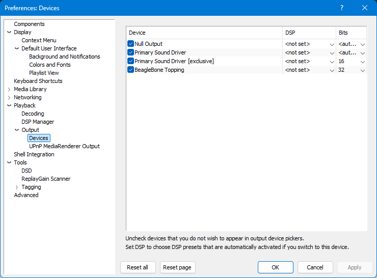
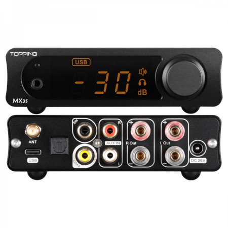

### `README.md`

|             🔋 1. Embedded Board              |                📡 2. Media Controller                 |                    🎛️ 3. Hardware DAC                    |
|:---------------------------------------------:|:-----------------------------------------------------:|:---------------------------------------------------------:|
|  |  |  |

# 🦮 beaglebone-gmediarender-valera

> Bit-perfect, ultra-low-latency 32-bit DLNA/UPnP Audio Renderer automated deployment tool for **BeagleBone** and *
*Topping DACs** (or any custom ALSA hardware).

Tired of overengineered cloud solutions, bloated Docker containers, and fragile hardware platforms? Meet **Valera
Mladshoy** — a lightweight, bare-metal Python-driven deployment script built for robust embedded audio. It tames the
classic `gmediarender` daemon, fixes sub-optimal ALSA routing, and stabilizes the pipeline to flawlessly stream heavy *
*DSD/DSF (up to 32-bit)** and FLAC directly to your DAC without a single drop or jitter.


## 🚀 Features

* **Automated Production Run:** Zero manual configuration file hacking. One script to rule the deployment.
* **Anti-Monopoly Process Control:** Automatically terminates and disables conflicting `mpd` services to grant exclusive
  hardware access.
* **Systemd Bulletproofing:** Injects a native systemd unit with proper `Restart=always` policies, eliminating legacy
  SysVinit ghost crashes.
* **Bit-Perfect 32-bit Pipeline:** Hard-coded ALSA routing explicitly designed to pass heavy DSD/DSF (DoP/Native)
  streams into external DACs without forced downsampling.
* **Hardware PMIC Integration:** Fully compliant with BeagleBone's physical power button for graceful OS shutdown,
  preventing SD card corruption.

---

## 🛠️ Installation & Deployment

1. **Create the deployment script** on your BeagleBone:
   
```bash
   nano valera_deploy.py

```

*(Paste the pure Python code into the file and save via Ctrl+O, Enter, Ctrl+X)*

2. **Grant execution permissions:**

```bash
chmod +x valera_deploy.py

```

3. **Execute the automation pipeline:**

```bash
sudo ./valera_deploy.py

```

When the log outputs the final **🎉 GOAL!!!**, the service is locked, loaded, armed in autostart, and waiting for your
media stream.

---

## 🎛️ Audio Controller Configuration (foobar2000)

1. Open your Windows Media Control or **foobar2000**.
2. Navigate to `Preferences -> Playback -> Output -> Devices` and choose **BeagleBone Topping**.
3. Set the output bit depth strictly to **32-bit** to ensure clean DSF container passing.
4. Fire up your heavy metal stream and enjoy pure hardware rendering.

---

## 🔋 Hardware Maintenance Note

* **24/7 Operation:** This is an industrial embedded setup. Power consumption is < 2W in peak. It is designed to run
  continuously without reboots.
* **Battery DC Power Option:** For an ultra-clean, noise-free DC source, run the hardware from a powerbank. Ensure the
  powerbank features a "low-current/always-on" mode to prevent automated sleep intervals during track changes.
* **Graceful Power Off:** Never pull the live power cord. Press the physical **POWER** button on the BeagleBone board
  for 1-2 seconds. The system will safely unmount filesystems and shut down.


