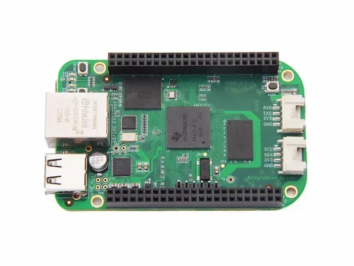
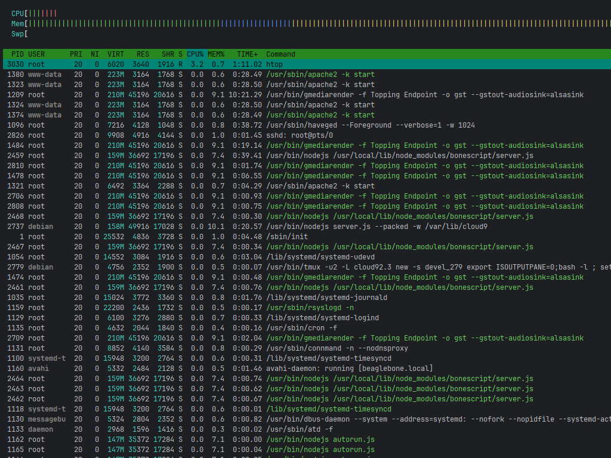
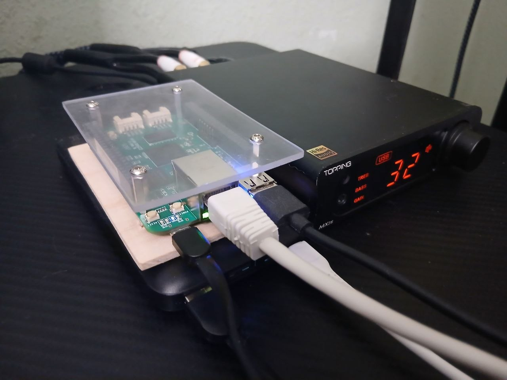

# beaglebone-gmediarender-valera

## Summary: Engineer's Log (Valera Jr. Bare-Metal Streamer)

An uncompromising audiophile streamer based on BeagleBone, deployed following industrial hardware standards. The
architecture entirely eliminates proprietary shells, redundant software conversions, and marketing crutches (such as
esoteric cables or uncontrolled sample-rate conversions).

|                 1. Embedded Board                 |                       2. Media App                        |                          3. Endpoint                          |
|:-------------------------------------------------:|:---------------------------------------------------------:|:-------------------------------------------------------------:|
|  |  |  |

|          Valera-MIPS          |                  htop                   | Mercyful Fate in here! an absolute bit-perfect, bare-metal pass-through! |
|:-----------------------------:|:---------------------------------------:|:------------------------------------------------------------------------:|
|  |  |       |

### Key Steps & Engineering Solutions:

1. **Base Image & Internal Memory Storage:** Built on a standard, field-tested **Debian** distribution deployed directly
   onto the industrial onboard eMMC flash memory, completely eliminating fragile MicroSD-card dependencies and
   contact-wear jitter.
2. **Hardware Binding (Direct Bus/I2S):** The UPnP/DLNA stream is delivered directly via GStreamer pass-through (
   `-o gst --gstout-audiosink=alsasink`) hardcoded to routing (`hw:1,0`), completely bypassing unnecessary software
   resamplers.
3. **Lifting Digital Constraints:** The endpoint initializes strictly at 100% volume (`--initial-volume=100`) at the
   daemon level to maintain an absolute bit-perfect stream over the network.
4. **Uncompromising Power Supply:** Ditching noisy switched-mode power supplies and dirty mains in favor of a pure
   analog source (powerbank). This revealed true micro-dynamics, eliminated jitter, and achieved crystal-clear sound
   staging that outperforms commercial Hi-End streamers.

## Accessing the Board

Connect power via your pure analog power source and log into the stable onboard eMMC environment via SSH:

```bash
ssh root@beaglebone.local

```

*(Direct root access is enabled; default password is `temppwd` if not changed).*

## Configure Onboard Linux

The board ships with a factory **Debian** image pre-installed on eMMC. Check the running version immediately after first
login:

```bash
cat /etc/os-release

```

    PRETTY_NAME="Debian GNU/Linux 9 (stretch)"
    NAME="Debian GNU/Linux"
    VERSION_ID="9"
    VERSION="9 (stretch)"
    ID=debian
    HOME_URL="https://www.debian.org/"
    SUPPORT_URL="https://www.debian.org/support"
    BUG_REPORT_URL="https://bugs.debian.org/"
    root@beaglebone:~# 

The factory image includes a built-in Node.js stack and a local documentation server — accessible in the LAN at
[http://beaglebone.local](http://beaglebone.local) while the board is powered. Useful for pinout references and
peripheral programming docs without going online.

### Bypassing the Mixer: Direct DMA Path

The critical configuration step is routing the audio stream directly to the hardware device, bypassing ALSA's
software mixer (dmix) entirely. The `hw:1,0` designator locks the stream to the raw kernel DMA buffer — no
resampling, no mixing, no volume scaling in software. The kernel hands PCM data straight to the I2S bus via DMA
transfer, and the DAC receives exactly what came off the network.

```
  [ Windows 11 / foobar2000 ]
  [ PCM 32-bit / DSD        ]
          |
          |  UPnP / DLNA (LAN)
  - - - - | - - - - - - - - - - - - BeagleBone
          v
  [ GMediaRender            ]  systemd daemon (autostart)
          |
          |  raw PCM frames
          v
  [ GStreamer  alsasink      ]  hw:1,0  --  dmix BYPASSED
          |
          |  kernel ALSA (hw interface)
          v
  [ DMA transfer (AM335x)   ]  <-- CPU IS OUT OF THE LOOP
          |
          |  I2S / McASP bus
          v
  [ DAC (Topping)           ]
```

This is enforced in the GMediaRender launch flags:

```
-o gst --gstout-audiosink=alsasink --gstout-audiodevice=hw:1,0
```

Any `plughw:` or `default:` designation silently re-enables dmix and destroys bit-perfect integrity.

### Low-Level Hardware & ALSA Diagnostics

Verify that the bit-perfect stream reaches the physical layer without resampling or software mixing.

* **List active audio hardware interfaces and subdevices:**

```bash
aplay -l

```

    **** List of PLAYBACK Hardware Devices ****
    card 1: MX3s [MX3s], device 0: USB Audio [USB Audio]
      Subdevices: 1/1
      Subdevice #0: subdevice #0

* **Inspect stream routing directly from the kernel ring buffer:**

```bash
dmesg | grep -i alsa

```

    [    1.967043] ALSA device list:

> **Architectural Note:** An empty initialization list at early boot (`~1.96s`) is the correct, expected state. Onboard
> audio interfaces are explicitly stripped via device tree overlays to maintain a pristine, jitter-free environment.
> High-fidelity rendering is offloaded entirely to the external asynchronous USB DAC subsystem, which maps dynamically
> post-boot. Always use `aplay -l` to verify live endpoints.

### Industrial Storage Health (eMMC)

Monitor the physical integrity of the boot medium acquired from local sources.

* **Check available disk space and partition table mapping:**

```bash
df -h

```

    Filesystem      Size  Used Avail Use% Mounted on
    udev            215M     0  215M   0% /dev
    tmpfs            49M  5.3M   44M  11% /run
    /dev/mmcblk1p1  3.5G  3.1G  230M  94% /
    tmpfs           242M     0  242M   0% /dev/shm
    tmpfs           5.0M  4.0K  5.0M   1% /run/lock
    tmpfs           242M     0  242M   0% /sys/fs/cgroup
    tmpfs            49M     0   49M   0% /run/user/0

* **Inspect free RAM and system load average (ensuring < 0.1 during playback):**

```bash
htop

```

*(Install via `sudo apt install htop` if missing).*

## Installation & Deployment

1. **Create the deployment script** on your BeagleBone:

```bash
nano valera_deploy.py

```

*(Paste the updated Python code into the file and save via Ctrl+O, Enter, Ctrl+X)*

2. **Grant execution permissions:**

```bash
chmod +x valera_deploy.py

```

3. **Execute the automation pipeline:**

```bash
sudo ./valera_deploy.py

```

When the log outputs the final **🎉 GOAL!!!**, the service is locked, loaded, armed in autostart (as an override
drop-in), and waiting for your media stream.

## Configure foobar2000 on Windows 11

1. Navigate to `Preferences -> Playback -> Output -> Devices` and choose **Topping Endpoint**.
2. Set the output bit depth strictly to **32-bit** to ensure clean DSF container passing.
3. Fire up your heavy metal stream and enjoy pure hardware rendering.

## Hardware Maintenance Note

* **24/7 eMMC Operation:** This is an industrial embedded setup using solid internal flash. Power consumption is < 2W in
  peak. It is designed to run continuously without reboots.
* **Battery DC Power Option:** For an ultra-clean, noise-free DC source, run the hardware from a powerbank. Ensure the
  powerbank features a "low-current/always-on" mode to prevent automated sleep intervals during track changes.
* **Graceful Power Off:** Never pull the live power cord. Press the physical **POWER** button on the BeagleBone board
  for 1-2 seconds. The system will safely unmount filesystems from eMMC and shut down.

## Terminal Support & Diagnostics

### Process & Daemon Management

To tame the systemd hound and manage the rendering endpoint directly:

* **Verify live process memory and active command-line arguments:**

```bash
ps aux | grep gmediarender

```

* **Real-time system journal tracking (stderr/stdout output):**

```bash
journalctl -u gmediarender.service -f --no-tail

```

* **Check live daemon status:**

```bash
sudo systemctl status gmediarender

```

    ● gmediarender.service - GMediaRender Daemon
       Loaded: loaded (/lib/systemd/system/gmediarender.service; enabled; vendor preset: enabled)
      Drop-In: /etc/systemd/system/gmediarender.service.d
               └─override.conf
       Active: active (running) since Thu 2026-06-25 22:45:59 UTC; 4h 27min ago
     Main PID: 1242 (gmediarender)
       CGroup: /system.slice/gmediarender.service
               └─1242 /usr/bin/gmediarender -f Topping Endpoint -o gst --gstout-audiosink=alsasink
    
    Jun 25 22:45:59 beaglebone systemd[1]: Started GMediaRender Daemon.
    Jun 25 22:46:00 beaglebone gmediarender[1242]: gmediarender 0.0.7-git started [ gmediarender 0.0.7-git (libupnp-1.6.19+git20160116; glib-2.49.6; gstreamer-1.8.3) ].
    Jun 25 22:46:00 beaglebone gmediarender[1242]: Logging switched off. Enable with --logfile=<filename> (e.g. --logfile=/dev/stdout for console)
    Jun 25 22:46:11 beaglebone gmediarender[1242]: Ready for rendering.

* **Force immediate restart (applying overrides):**

```bash
sudo systemctl restart gmediarender

```

* **Wipe fail-states and clear journal anomalies:**

```bash
sudo systemctl reset-failed gmediarender

```

* **Total daemon termination:**

```bash
sudo systemctl stop gmediarender

```

### Network & End-Point Visibility

Ensure the UPnP/DLNA endpoint advertises itself properly across the local network segment.

* **Check active network sockets and port binding (UPnP port 8200):**

```bash
sudo ss -tulpn | grep gmediarender

```

* **Ping the board locally to verify zero-latency connection:**

```bash
ping -c 4 beaglebone.local

```
