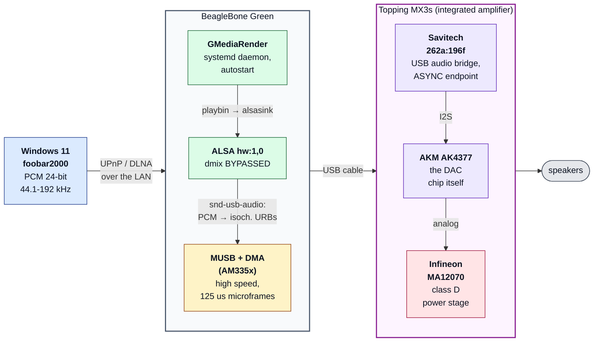
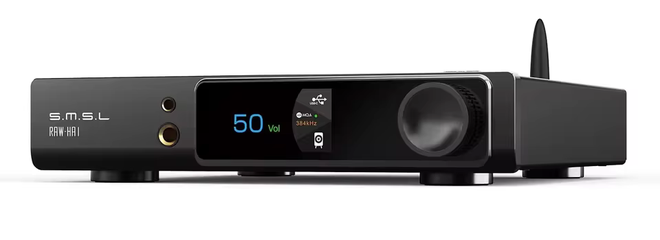

# beaglebone-gmediarender-valera

## Summary: Engineer's Log (Valera Jr. Bare-Metal Streamer)

An uncompromising audiophile streamer based on BeagleBone Green.
The architecture entirely eliminates proprietary shells, redundant software conversions, and marketing crutches (such as
esoteric cables or uncontrolled sample-rate conversions).

|                 1. Embedded Board                 |                       2. Media App                        |                          3. Endpoint                          |
|:-------------------------------------------------:|:---------------------------------------------------------:|:-------------------------------------------------------------:|
|  |  |  |

|          Valera-MIPS          |                  htop                   |          an absolute bit-perfect, bare-metal pass-through!          |
|:-----------------------------:|:---------------------------------------:|:-------------------------------------------------------------------:|
|  |  |  |

### Key Steps & Engineering Solutions:

1. **Base Image & Internal Memory Storage:** Built on a standard, field-tested **Debian** distribution deployed directly
   onto the industrial onboard eMMC flash memory, completely eliminating fragile MicroSD-card dependencies and
   contact-wear jitter. **(2026-09-05: this aged badly. The factory eMMC image carries a 2018 kernel whose
   USB-audio feedback handling is broken, and the working system now boots from a microSD card. See*
   The third hunt*.)**
2. **Hardware Binding (Direct to `hw:1,0`):** The UPnP/DLNA stream is delivered via GStreamer
   (`-o gst --gstout-audiosink=alsasink`) onto the raw hardware device, routed there by `/etc/asound.conf`,
   with ALSA's `dmix` software mixer out of the path entirely.
3. **Lifting Digital Constraints:** The renderer runs at volume 100 (0 dB), where `playbin`'s volume element sits in
   passthrough and touches no samples. This is the daemon's own default - there is no launch flag in `ExecStart`,
   and it needs none. What matters is that the control point never moves the slider (see the check below).
4. **Power Supply:** Powered from a PC USB port, I could hear the PC. Anything that gets the board off that rail
   fixes it - a powerbank, a USB socket on a mains filter, even a phone charger. A linear supply (~$50) is the
   ideal, but not a prerequisite.

## Accessing the Board

Connect power and log into the stable onboard eMMC environment via SSH:

```bash
ssh root@beaglebone.local

```

*(Direct root access is enabled; default password is `temppwd` if not changed).*

## Configure Onboard Linux

The board ships with a factory **Debian** image pre-installed on eMMC. Check the running version immediately after first
login:

```bash
cat /etc/os-release

```

    PRETTY_NAME="Debian GNU/Linux 9 (stretch)"
    NAME="Debian GNU/Linux"
    VERSION_ID="9"
    VERSION="9 (stretch)"
    ID=debian
    HOME_URL="https://www.debian.org/"
    SUPPORT_URL="https://www.debian.org/support"
    BUG_REPORT_URL="https://bugs.debian.org/"
    root@beaglebone:~# 

The factory image includes a built-in Node.js stack and a local documentation server — accessible in the LAN at
[http://beaglebone.local](http://beaglebone.local) while the board is powered. Useful for pinout references and
peripheral programming docs without going online.

### Bypassing the Mixer: The Actual Signal Path

The critical configuration step is routing the audio stream directly to the hardware device, bypassing ALSA's
software mixer (`dmix`) entirely. The `hw:1,0` designator locks the stream to the raw kernel DMA buffer - no
mixing, no volume scaling in software.

Note what `hw:1,0` is *not* here. No I2S DAC is attached to this board. The AM335x McASP peripheral - the SoC's
native I2S engine, brought out on the P9 header - is unused, and onboard audio is stripped via device tree
overlays. The endpoint is an external asynchronous USB device, so the DMA transfer feeds the FIFO of the MUSB
USB 2.0 host controller. I2S does exist in this chain, but inside the MX3s, downstream of the USB bridge.

The MX3s itself is an integrated amplifier, not a DAC box: the Savitech bridge hands I2S to an AKM AK4377,
and its analog output drives an Infineon MA12070 class D power stage. Everything past the USB cable is one
sealed unit - the diagram below shows it only to place the I2S link where it actually is.


```mermaid
flowchart LR
    SRC["<b>Windows 11</b><br/><b>foobar2000</b><br/>PCM 24-bit<br/>44.1-192 kHz"]

    subgraph BBG["BeagleBone Green"]
        direction TB
        GMR["<b>GMediaRender</b><br/>systemd daemon,<br/>autostart"]
        ALSA["<b>ALSA hw:1,0</b><br/>dmix BYPASSED"]
        MUSB["<b>MUSB + DMA</b><br/><b>(AM335x)</b><br/>high speed,<br/>125 us microframes"]
        GMR -- "playbin &rarr; alsasink" --> ALSA
        ALSA -- "snd-usb-audio:<br/>PCM &rarr; isoch. URBs" --> MUSB
    end

    subgraph MX3S["Topping MX3s (integrated amplifier)"]
        direction TB
        SAV["<b>Savitech</b><br/><b>262a:196f</b><br/>USB audio bridge,<br/>ASYNC endpoint"]
        AKM["<b>AKM AK4377</b><br/>the DAC<br/>chip itself"]
        MA["<b>Infineon</b><br/><b>MA12070</b><br/>class D<br/>power stage"]
        SAV -- "I2S" --> AKM
        AKM -- "analog" --> MA
    end

    SPK(["speakers"])

    SRC -- "UPnP / DLNA<br/>over the LAN" --> BBG
    BBG -- "USB cable" --> MX3S
    MX3S --> SPK

    classDef host fill:#dbeafe,stroke:#1e3a8a,stroke-width:1px,color:#0b1220
    classDef soft fill:#dcfce7,stroke:#166534,stroke-width:1px,color:#0b1220
    classDef kern fill:#fef3c7,stroke:#92400e,stroke-width:1px,color:#0b1220
    classDef digi fill:#ede9fe,stroke:#5b21b6,stroke-width:1px,color:#0b1220
    classDef anlg fill:#ffe4e6,stroke:#9f1239,stroke-width:1px,color:#0b1220
    classDef out  fill:#e5e7eb,stroke:#374151,stroke-width:1px,color:#0b1220

    class SRC host
    class GMR soft
    class ALSA soft
    class MUSB kern
    class SAV digi
    class AKM digi
    class MA anlg
    class SPK out

    style BBG fill:#f8fafc,stroke:#475569,stroke-width:2px,color:#0b1220
    style MX3S fill:#fdf4ff,stroke:#86198f,stroke-width:2px,color:#0b1220
```

**The clock lives at the endpoint.** The playback endpoint enumerates as `ASYNC`: the DAC's own oscillator is
master, and the host adapts to its feedback. This is precisely what an S/PDIF link cannot offer - there the
receiver has to recover the clock from the wire with a PLL, and the source's oscillator, however expensive, is
discarded at the far end.

This is enforced in two places working together. The GMediaRender launch flag:

```
-o gst --gstout-audiosink=alsasink
```

And the global ALSA routing in `/etc/asound.conf` which maps `pcm.!default` to `hw:1,0`. The alsasink picks
up the default device from there — no device hardcoded in the flags, no dmix in the path.

Any `plughw:` or `default:` in `/etc/asound.conf` silently re-enables dmix and destroys bit-perfect integrity.

### Low-Level Hardware & ALSA Diagnostics

Verify that the bit-perfect stream reaches the physical layer without resampling or software mixing.

* **List active audio hardware interfaces and subdevices:**

```bash
aplay -l

```

    **** List of PLAYBACK Hardware Devices ****
    card 1: MX3s [MX3s], device 0: USB Audio [USB Audio]
      Subdevices: 1/1
      Subdevice #0: subdevice #0

* **Inspect stream routing directly from the kernel ring buffer:**

```bash
dmesg | grep -i alsa

```

    [    1.967043] ALSA device list:

> **Architectural Note:** An empty initialization list at early boot (`~1.96s`) is the correct, expected state. Onboard
> audio interfaces are explicitly stripped via device tree overlays to maintain a pristine, jitter-free environment.
> High-fidelity rendering is offloaded entirely to the external asynchronous USB DAC subsystem, which maps dynamically
> post-boot. Always use `aplay -l` to verify live endpoints.

* **Identify the USB bridge inside the MX3s:**

```bash
lsusb

```

    Bus 001 Device 002: ID 262a:196f
    Bus 001 Device 001: ID 1d6b:0002 Linux Foundation 2.0 root hub

Vendor `262a` is SAVITECH - the USB-to-I2S bridge inside the MX3s. (`152a` would mean Thesycon/XMOS, `0d8c`
C-Media.) Which bridge it is matters far less than how its endpoint is clocked, which is the next check.

* **Verify the endpoint is asynchronous and list what the DAC actually accepts:**

```bash
cat /proc/asound/card1/stream0

```

    TOPPING MX3s at usb-musb-hdrc.1-1, high speed : USB Audio

    Playback:
      Status: Running
        Interface = 2
        Altset = 2
        Momentary freq = 44100 Hz (0x5.8333)
        Feedback Format = 16.16
      Interface 2
        Altset 1
        Format: S16_LE
        Channels: 2
        Endpoint: 3 OUT (ASYNC)
        Rates: 44100, 48000, 88200, 96000, 176400, 192000
        Data packet interval: 125 us
      Interface 2
        Altset 2
        Format: S24_3LE
        Channels: 2
        Endpoint: 3 OUT (ASYNC)
        Rates: 44100, 48000, 88200, 96000, 176400, 192000
        Data packet interval: 125 us

> **Hardware ceiling - read this before tuning anything upstream.** *(2026-09-05: this describes the
> Topping MX3s. A different DAC on the same board reports `S32_LE` only, with a native DSD altsetting
> and rates to 768 kHz - so read your own `stream0` rather than assuming these numbers.)* The DAC
> exposes exactly two formats,
> `S16_LE` and `S24_3LE`, and tops out at 192 kHz. There is no 32-bit altsetting and no DSD altsetting on this
> device. Feeding it 32-bit or DSD unlocks nothing; it only guarantees a conversion somewhere earlier in the
> chain. Note also `Feedback Format` - that is the DAC telling the host how fast to send, which is asynchronous
> mode doing its job.

* **Prove nothing is resampling, and see which format the sender actually chose - run this while a
  track is playing:**

```bash
cat /proc/asound/card1/pcm0p/sub0/hw_params

```

    access: RW_INTERLEAVED
    format: S24_3LE
    subformat: STD
    channels: 2
    rate: 44100 (44100/1)
    period_size: 441
    buffer_size: 8820

The `rate` must match the source file. A 96 kHz file reporting `rate: 44100` means GStreamer inserted a
resampler, and no setting in `/etc/asound.conf` can fix that - `playbin` builds its own `audioconvert` and
`audioresample` a layer above ALSA. This file is the only honest proof of a bit-perfect path; the launch flags
are not.

It is also the fastest way to see what the sender is really doing, because `format` follows whatever
foobar2000's UPnP plugin decided to stream - a setting that lives on the PC, not here:

| `format` says | the plugin is sending                                                            | DAC altset |
|:--------------|:---------------------------------------------------------------------------------|:-----------|
| `S24_3LE`     | 24-bit, via `preferred-format=WAV` (or the FLAC default)                         | 2          |
| `S16_LE`      | 16-bit, via `preferred-format=LPCM` - that is `audio/L16`, 16 bits by definition | 1          |

Cross-check it against the wire, which settles the FLAC-versus-WAV question without guessing:

```bash
a=$(awk '/eth0:/{print $2}' /proc/net/dev); sleep 8; b=$(awk '/eth0:/{print $2}' /proc/net/dev); echo $(( (b-a)/8 )) bytes/s

```

    ~176 KB/s  ->  16-bit LPCM      (176400 B/s raw)
    ~272 KB/s  ->  24-bit FLAC      (larger than raw 24-bit - it is not compressing anything)
    ~296 KB/s  ->  24-bit WAV       (264600 B/s raw, plus HTTP/TCP overhead)

> ~~**The FLAC finding - read this if you hear a periodic click.**~~ **Withdrawn 2026-09-05:
> the click was the kernel, not the decoder.** On `5.10.240-bone80` the same 24-bit FLAC stream
> plays clean, and frame delivery measures 0.00% off nominal. The paragraph below is kept as
> written; see *The third hunt* for what actually caused it and how the format experiment came
> to look conclusive. The bandwidth figures in the table above are still correct.
>
> The plugin defaults to
> `preferred-format=FLAC`, and on this board that default produces an audible click roughly once a
> minute. foobar2000 streams the entire session as one FLAC of unknown length, and GStreamer 1.8.3
> here does not survive it cleanly; the plugin's own config file warns about this class of device
> outright - *"Many report that they support FLAC yet fail to play an infinite length FLAC stream"*.
> It is also pure overhead: foobar encodes at speed, so the FLAC stream measures **larger** than raw
> 24-bit PCM while still costing the board a real-time decode. Switching to `preferred-format=WAV`
> removes the decoder and keeps all 24 bits - identical `format`, identical altset, identical packet
> size, minus the clicks. See the foobar2000 section below for the full comparison, and the click
> hunt section for how everything else in the chain was eliminated first.

### Industrial Storage Health (eMMC)

Monitor the physical integrity of the boot medium acquired from local sources.

* **Check available disk space and partition table mapping:**

```bash
df -h

```

    Filesystem      Size  Used Avail Use% Mounted on
    udev            215M     0  215M   0% /dev
    tmpfs            49M  5.3M   44M  11% /run
    /dev/mmcblk1p1  3.5G  3.1G  230M  94% /
    tmpfs           242M     0  242M   0% /dev/shm
    tmpfs           5.0M  4.0K  5.0M   1% /run/lock
    tmpfs           242M     0  242M   0% /sys/fs/cgroup
    tmpfs            49M     0   49M   0% /run/user/0

#### Stop the daily writes that buy nothing

Stretch is end-of-life, so the only entry in `sources.list` points at `archive.debian.org` - a frozen
archive whose contents will never change again. Yet `apt-daily.timer` and `apt-daily-upgrade.timer`
ship enabled, and every day they re-download ~28 MB of package lists and rebuild ~46 MB of binary
caches from that immutable archive.

On a board praised for its industrial eMMC and month-long uptimes, that is a daily rewrite of 74 MB of
flash for exactly nothing - plus a daily burst of network and disk activity on a machine whose timing
we care about enough to have hunted a click through it.

```bash
sudo systemctl disable --now apt-daily.timer apt-daily-upgrade.timer

```

Then clear what they already accumulated, once:

```bash
sudo apt-get clean && sudo rm -rf /var/lib/apt/lists/*

```

That returned 74 MB here, taking the root filesystem from 97% to 95% full. `apt-get install` will
refuse to work until you run `apt-get update` yourself - which is the point: the lists come back when
you actually need them, not every morning. Re-enable the timers with `systemctl enable` if you ever
want the old behaviour back.

A further ~69 MB sits in `/opt/source`, which belongs to no package at all - it is a set of git
checkouts the factory image ships. Device trees for kernels that are not installed (this board runs
4.9.78) and `BBBlfs`, a USB boot utility with no role here:

```bash
sudo rm -rf /opt/source/BBBlfs /opt/source/dtb-4.4-ti /opt/source/dtb-4.14-ti

```

All three are plain git clones and come back with a `git clone` if ever wanted. **Leave
`/opt/source/bb.org-overlays` alone** - the device tree overlays that strip the onboard audio codec
depend on it.

Beyond that the factory image still carries a browser, an IDE, a desktop icon set and an OpenCL SDK
for a different SoC - well over a gigabyte. Removing those means removing packages, and on an archived
distribution that is close to irreversible, so it is left as a deliberate decision rather than a
recipe.

* **Inspect free RAM and system load average (ensuring < 0.1 during playback):**

```bash
htop

```

*(Install via `sudo apt install htop` if missing).*

## Installation & Deployment

1. **Create the deployment script** on your BeagleBone:

```bash
nano valera_deploy.py

```

*(Paste the updated Python code into the file and save via Ctrl+O, Enter, Ctrl+X)*

The script detects the card index itself rather than assuming one. That matters
more than it sounds: there is no onboard codec here, so the USB DAC takes
whatever index is free - `1` on the factory eMMC image, `0` on a current one -
and a hardcoded index does not fail loudly, the renderer simply never opens the
device.

2. **Grant execution permissions:**

```bash
chmod +x valera_deploy.py

```

3. **Execute the automation pipeline:**

```bash
sudo ./valera_deploy.py

```

When the log outputs the final **🎉 GOAL!!!**, the service is locked, loaded, armed in autostart (as a canonical
unit in `/lib/systemd/system`, with any legacy drop-in purged), and waiting for your media stream.

## Configure foobar2000 on Windows 11

**The renderer is not configured under `Output -> Devices`.** That page lists local sound cards, and its
bit-depth setting has no effect whatsoever on a UPnP renderer - the stream format is decided by the
plugin. Go to `Preferences -> Playback -> Output -> UPnP MediaRenderer Output`, which is a text
configuration, and set:

```
preferred-format=WAV
```

Then leave the DSP chain empty - no resampler, no volume normalisation, no ReplayGain at output - and
start playback. The renderer negotiates the format when a stream begins, so a change here needs
playback restarted, not just applied.

### Why WAV and not the other two

The plugin offers `FLAC`, `WAV` and `LPCM`, and defaults to FLAC. On this board that default is the
wrong choice, and not by a small margin. Measured on the wire and at `hw_params`:

| `preferred-format` |      wire | ALSA gets | DAC altset | decoder on the board | clicks  |
|:-------------------|----------:|:----------|:-----------|:---------------------|:--------|
| `FLAC` (default)   | ~272 KB/s | `S24_3LE` | 2          | yes, real-time FLAC  | **yes** |
| `LPCM`             | ~176 KB/s | `S16_LE`  | 1          | no                   | no      |
| `WAV`              | ~296 KB/s | `S24_3LE` | 2          | no                   | no      |

~~**FLAC produces a periodic click.**~~ **Withdrawn 2026-09-05 - it was the kernel.** Kept below
as originally written. WAV remains a perfectly reasonable choice, but it is no longer the fix for
anything, and on CD-sourced material `LPCM` costs a third less on the bus for no loss at all.

foobar2000 streams the whole session as a single FLAC of unknown
length, and GStreamer 1.8.3 on this board does not survive it cleanly. The plugin's own configuration
file warns about exactly this class of device: *"Many report that they support FLAC yet fail to play an
infinite length FLAC stream"*. It also buys nothing here - foobar encodes at speed, so the FLAC stream
measured *larger* than raw 24-bit PCM. The board spends cycles unpacking a stream that was never
compressed.

**LPCM is `audio/L16`, which is 16 bits by definition.** There is no 24-bit LPCM in this plugin, so
choosing it silently halves the format ceiling. Fine for CD-rip material, a truncation for hi-res.

**WAV keeps 24 bits and removes the decoder.** Same altset, same USB packet size, same bytes per frame
as the FLAC path - only the decode is gone. That is why it is the right answer rather than a
compromise, and why the click hunt used it as the deciding experiment: it changes one variable.

On bit depth: match the material, do not maximise it. A 16-bit source padded to 24 gains nothing and
costs half again as much bandwidth. And 32 bits cannot reach this DAC at all - `stream0` lists exactly
two formats, `S16_LE` and `S24_3LE`, so a 32-bit stream only guarantees a conversion earlier in the
chain.

> **On DSD:** *(2026-09-05: true of the factory eMMC build only. On the microSD system - GStreamer
> 1.26 and a DAC with a native DSD altsetting - DSD128 plays over DoP at 5.6448 MHz, which is
> 2 822 400 bytes/s on the bus, delivered at +160 ppm. See* The third hunt*.)*
> It does not work in this build, and cannot. GStreamer 1.8.3 has no DSD decoder (`dsddec`
> arrived in 1.24), and the DAC has no DSD altsetting to receive it anyway. Feed it PCM.

## Hardware Maintenance Note

* **24/7 eMMC Operation:** This is an industrial embedded setup using solid internal flash. Power consumption is < 2W in
  peak. It is designed to run continuously without reboots.
* **If Running Off a Powerbank:** Pick one with a "low-current/always-on" mode, otherwise it goes to sleep on the
  board's low draw and cuts power during track changes.
* **Graceful Power Off:** Never pull the live power cord. Press the physical **POWER** button on the BeagleBone board
  for 1-2 seconds. The system will safely unmount filesystems from eMMC and shut down.

## Terminal Support & Diagnostics

### Process & Daemon Management

To tame the systemd hound and manage the rendering endpoint directly:

* **Verify live process memory and active command-line arguments:**

```bash
ps aux | grep gmediarender

```

* **Real-time system journal tracking (stderr/stdout output):**

```bash
journalctl -u gmediarender.service -f --no-tail

```

* **Check live daemon status:**

```bash
sudo systemctl status gmediarender

```

    ● gmediarender.service - GMediaRender UPnP Renderer
       Loaded: loaded (/lib/systemd/system/gmediarender.service; enabled; vendor preset: enabled)
       Active: active (running) since Thu 2026-06-25 22:45:59 UTC; 4h 27min ago
     Main PID: 1216 (gmediarender)
       CGroup: /system.slice/gmediarender.service
               └─1216 /usr/bin/gmediarender -f BeagleBone Topping -o gst --gstout-audiosink=alsasink
    
    Jun 25 22:45:59 beaglebone systemd[1]: Started GMediaRender UPnP Renderer.
    Jun 25 22:46:00 beaglebone gmediarender[1216]: gmediarender 0.0.7-git started [ gmediarender 0.0.7-git (libupnp-1.6.19+git20160116; glib-2.49.6; gstreamer-1.8.3) ].
    Jun 25 22:46:00 beaglebone gmediarender[1216]: Logging switched off. Enable with --logfile=<filename> (e.g. --logfile=/dev/stdout for console)
    Jun 25 22:46:11 beaglebone gmediarender[1216]: Ready for rendering.

There is no `Drop-In:` line: `valera_deploy.py` deletes `/etc/systemd/system/gmediarender.service.d` and writes
the unit itself, so the override mechanism is deliberately out of the picture.

* **Force immediate restart (applying overrides):**

```bash
sudo systemctl restart gmediarender

```

* **Wipe fail-states and clear journal anomalies:**

```bash
sudo systemctl reset-failed gmediarender

```

* **Total daemon termination:**

```bash
sudo systemctl stop gmediarender

```

### Checking that the chain actually delivers

`valera_rate_check.py` answers the one question every other measurement in this
file turned out to depend on: **does the host send the frames the DAC is asking
for?** In asynchronous USB audio the device owns the clock and requests a rate
through its feedback endpoint. If the host does not follow, the DAC FIFO drains
at the difference and breaks up on a schedule - buffer depth divided by the
deficit is the interval between audible faults.

```bash
sudo ./valera_rate_check.py

```

    card 0 (AUDIO), format S32_LE
    device advertises: 44100, 48000, 88200, 96000, 176400, 192000, 352800, ...
    45 s per rate, silence - nothing comes out of the speakers

         rate   delivered     ratio           DAC asked verdict
        44100       44100    1.0000        44100..44101 OK

It finds the card, picks the widest format the device takes and reads the rate
list out of the descriptor, so nothing is hardcoded. `--sweep` walks every rate
the DAC advertises; `-s` sets the seconds per rate. The source is `/dev/zero`,
so it can run while the amplifier is at listening volume without a sound coming
out - which also means it can be run on a system nobody is sitting at.

Read the output like this:

| what you see | what it means |
|:--|:--|
| ratio `1.0000`, device asking its nominal rate | the chain works |
| ratio near 1, device **`PEGGED`** at some other value | the feedback loop is not closing - the host sends at its own rate and ignores the request |
| ratio well below 1, and the same fraction at every rate | a driver defect. Saturation produces scatter and xruns, not a clean 5/6 |
| `XRUN` in the verdict | the pipeline missed its deadline - that one is above ALSA |

This is the tool that ended a two-day search in forty five seconds, after the
ear-and-stopwatch method had produced four confident and wrong answers. Prefer
it to `valera_click_hunt.py`, which is kept for the record and carries a notice
saying so.

### Hunting a Periodic Click

A click that arrives on a schedule is not a cable fault until proven otherwise - a cable does not keep
time. Something on the board does. `valera_click_hunt.py` runs on the board while sound is playing and
watches three layers at once, because they fail independently:

| layer     | what it samples                                                      | what it catches                        |
|:----------|:---------------------------------------------------------------------|:---------------------------------------|
| ALSA ring | `state`, buffer fill, `avail_max`                                    | the pipeline missing its deadline      |
| USB       | host controller irq/s, the DAC feedback value, hardware `delay`      | a missed isochronous slot              |
| machine   | per-process CPU, datagrams sent, interface bytes, kernel ring buffer | housekeeping bursts and network stalls |

**A full ALSA ring does not prove the USB stream is clean.** The ring sits above the URB queue: if
MUSB is late submitting a URB for its 125 us slot, the DAC's FIFO empties for an instant and clicks,
while the 200 ms ring never notices a thing. On AM335x that is the weak link, not the buffer.

Copy it over and run it during playback:

```bash
scp valera_click_hunt.py root@beaglebone.local:~/

```

```bash
sudo ./valera_click_hunt.py -s 300

```

Press Enter every time you hear a click. Those markers are the only thing that ties the audible
symptom to what the board was actually doing, and the report correlates them against every event
class it recorded.

#### Bisecting the chain

`--tone` drives the DAC directly through `speaker-test` - no network, no UPnP, no GStreamer anywhere
in the path, just ALSA to USB to the DAC. **Turn the amplifier down first**, then:

```bash
sudo ./valera_click_hunt.py --tone -s 300

```

A click on a steady sine is also far easier to hear than one buried in music. The answer is binary:
if the click survives `--tone`, everything above ALSA is innocent; if it vanishes, the fault is in
GStreamer, libupnp or the source.

#### Reading the verdict

* **`DRAIN` / `STARVE` / `STALL`** - the pipeline missed its deadline and the ring ran dry. A
  scheduling problem: governor, daemon priority, or whatever the `CPU` line names.
* **`USBIRQ` / `DELAY` / `FEEDBACK`** - the ring was full but the USB layer twitched. The click
  happened *below* ALSA: isochronous scheduling, the port, the cable, or the DAC's feedback loop.
* **`CPUSPIKE`** - a process burned far more than its own normal share for one
  second. Judged against each process's own median, not a fixed threshold: periodic
  housekeeping on a board this slow never crosses a fixed bar, it only stands out
  against itself.
* **`NET`** - a burst of datagrams or a stall in the incoming stream. A UPnP renderer
  re-advertises itself over SSDP from inside the same process that feeds the DAC, and
  that burst lands here without needing tcpdump.
* **Nothing correlates** - the ring stayed full, the URB queue stayed steady, no spike. Then it is
  not the board at all: power rail, ground, or the DAC acting on its own.

Two notes on this particular kernel. `4.9.78-ti-r94` is built without `CONFIG_SND_DEBUG`, so
`xrun_debug` does not exist and **the kernel cannot log an underrun** - the `avail_max` series is the
only underrun evidence available. And the board has two MUSB controllers: `musb-hdrc.0` is the unused
gadget port with permanently zero interrupts, `musb-hdrc.1` is the one the DAC hangs off. Watching the
wrong one produces a screenful of meaningless alarms; the tool now reads the right name out of
`/proc/asound/card1/stream0`.

The report closes with an inventory of everything on the board that wakes on a schedule - systemd
timers, `cron`, and running services - because a 60 s period has to come from somewhere.

#### What it actually found here

Worth recording, because the answer was nowhere near where the search started. A click roughly once a
minute turned out to be the FLAC decoder (see the foobar2000 section). Everything eliminated on the
way, and what eliminated it:

* **Scheduled load** - no timer or cron job has a minute period on this board, and no process other
  than `gmediarender` ever crossed 12% of the core in any second.
* **The pipeline starving** - the ALSA ring never fell below 93% of its 200 ms across three runs.
* **The USB layer, the cable, the DAC, the power rail** - `--silence` streams zeroes in the identical
  format, altset and byte rate. Five minutes, not one click. That one test cleared the whole lower half
  of the chain at once.
* **GStreamer's sink** - the trace showed the pipeline clock *is* `GstAudioSinkClock`, so the sink is
  the clock master and never slaves or skews. `skew 0`, `drop 0`, and the only two `resync` lines were
  at track start.
* **The clicks were never periodic.** The gaps were 14, 24, 65, 92, 49 s. "Once a minute" was an
  average, not a rhythm - which is what ruled out scheduled work early.

Two false leads are worth naming, because both looked convincing:

* `avail_max: 8379` on a 8820-frame buffer reads like a near-underrun. It is `buffer_size -
  period_size`, the value every stream shows after its first period is written. A start-up artefact.
* The DAC's feedback swinging 4974 ppm, with **every** marked click landing within 2 s of a swing. But
  those events blanketed 66% of the timeline, so chance alone predicted almost as many hits. This is
  why the verdict now prints an `expect` column - a chatty event class convicts itself otherwise.

#### The second hunt: a burble, and four days of instruments lying

The click hunt above found the FLAC decoder. What remained afterwards was a
different artefact - a soft burble rather than a tick, arriving in bursts:
sometimes once in a track, sometimes several inside one passage. It is worth
recording separately, because the search went wrong in a way that is easy to
repeat.

**Every instrument used on it produced a false positive at some point.** Four of
them, all found by cross-checking rather than by the tool noticing:

* **The tone generator clicked by itself.** `--tone` originally looped a 5 s
  file with `while :; do cat f; done | aplay`. Respawning `cat` jitters the pipe
  aplay reads, and the ALSA ring never shows it because the ring stays full.
  That harness produced ~35 clicks a minute on its own. Playing one file sized
  to the whole run, with no loop and no pipe, dropped it to nothing.
* **`expect` lied on every interrupted run.** `report()` was passed the
  *requested* duration, not the elapsed one. Stopping a 600 s run at 40 s
  divided every coverage figure by fifteen, and both event classes came out
  stamped `BEYOND CHANCE`. Corrected values were equal to the hit counts -
  pure chance, as before.
* **`NET` correlated with clicks by construction.** The marker is Enter over
  ssh, so the keystroke *is* the network traffic it then correlates against.
  174 bytes in, 90 out, once per click. That class can never convict while
  markers are typed remotely.
* **The USB interrupt dips were the hunter's own load.** Its reports showed
  `min 6590` against a median of 7939, a 17% shortfall that looked like missed
  isochronous slots. Measured without the hunter running, the minimum is 7916
  and the spread is 0.6%.

`--silence` also has a blind spot worth naming, since the first hunt leaned on
it: a dropped isochronous packet against digital zeroes is a zero followed by a
zero. It is inaudible. That test excludes continuous mechanisms - hum, coupling,
a ground loop - and is deaf to dropouts, which is the failure a marginal supply
actually produces. It never cleared the lower half of the chain; the write-up
above claimed it did, and that was wrong.

**What survived.** With `gmediarender` stopped, no network in the path and the
source a raw file in `/dev/shm`, the burble reproduces identically across every
route to the hardware:

| path                           | geometry                     | result  |
|:-------------------------------|:-----------------------------|:--------|
| `hw:1,0`                       | 10 / 20 / 40 / 80 ms periods | burbles |
| `plughw:1,0`                   | aplay defaults, ~125 ms      | burbles |
| `plug` &rarr; `dmix` at 48 kHz | its own, with resampling     | burbles |

Four buffer geometries spanning eight to one, three different routes, one with
a resampler and a mixing thread in the way. No difference. Meanwhile the ALSA
ring never fell below 95% of its 8820 frames, the MUSB interrupt rate held
7960-7968/s with no second below 2% of median, and no process crossed its own
normal CPU share.

So the pipeline, the buffer geometry, the renderer and the network are all
excluded, and nothing the board can count moves with the fault. That leaves what
the board cannot count: the supply rail, the connector, the cable, the USB PHY.
Powering the board from a PC port - a supply known bad here by ear - made it
audibly worse, which is the only dose-response result of the whole hunt.

> **Withdrawn 2026-09-05.** This section is kept as written, but its conclusion did not survive.
> The HID unbinding did not replicate on a second DAC, and on kernel 5.10 it makes no difference at
> all. What follows is a record of a plausible mechanism that turned out not to be the cause; see
> *The third hunt* below.

**What it was: two periodic endpoints on one weak scheduler.** The MX3s
enumerates a HID interface alongside its audio ones - the volume buttons on its
own front panel:

```
hid-generic 0003:262A:196F.0002: input,hidraw0: USB HID v1.00 Device [TOPPING MX3s]
```

So the bus carries two periodic schedules at once: the 125 us isochronous audio
stream and the HID interrupt poll. The MUSB host controller in the AM335x
schedules periodic transfers in software, and it handles that pairing badly.
The two periods drift through each other; where they coincide the DAC loses
slots, and where they separate it is silent. That is the burst pattern, and it
explains why nothing on the board ever saw it: a dropped isochronous packet is
never retried and never logged, and it happens below ALSA, which is why no
buffer geometry and no route to the hardware made any difference.

Unbinding `usbhid` from the interface and counting, minute by minute, against
the same run with it bound: burbling constantly with HID, 38 in five minutes
without. Made permanent by telling the driver to ignore the device rather than
unbinding it after the fact - a udev rule matching the interface fires, but the
`unbind` inside an `add` event does not take:

```
cmdline=coherent_pool=1M net.ifnames=0 quiet usbhid.quirks=0x262a:0x196f:0x00000004
```

`0x4` is `HID_QUIRK_IGNORE`. The parameter is read-only at runtime in this
kernel, so it has to go on the kernel command line in `/boot/uEnv.txt` and
needs a reboot. Verify with `cat /proc/cmdline`, that
`ls /sys/bus/usb/drivers/usbhid/` no longer lists the interface, and that
`aplay -l` still shows the card - the quirk suppresses only the HID interface,
`snd-usb-audio` still claims interfaces 1 and 2. The interface carries nothing
a headless renderer uses.

**On music, that is the end of it.** The residual 38 per five minutes are
audible on a continuous tone and masked by dense material - which is the whole
reason the sine was built as the instrument, and the reason its count must not
be read as the practical result.

**Excluded on the way, each by direct experiment rather than by argument:** the
supply (unchanged on returning to the filter), the USB cable (replaced, no
change), the ALSA configuration (`hw`, `plughw` and `dmix` alike), the buffer
geometry (10/20/40/80 ms periods, and an interrupt rate flat to 0.5% across all
four), the device tree overlays (`uEnv.txt` turned out never to have been
touched), and the DAC and amplifier themselves (a different source plays through
both cleanly).

#### The third hunt: it was the kernel the whole time

The second hunt ended with the configuration exhausted and the fault still
there. Everything reachable from userspace had been changed and measured: three
routes to the hardware, four buffer geometries, two sample rates, two bit
depths, four power sources, two USB cables, two DACs, two amplifiers. Nothing
moved the symptom. What had never been touched was the kernel - the factory
image ships `4.9.78-ti-r94`, built in January 2018.

**The measurement that made the search possible.** Until this point every test
was five minutes of listening and counting burbles by ear, and the per-minute
count ranged from 0 to 31 - a spread wide enough that four separate conclusions
were drawn from it and all four were later withdrawn. What ended that was a
blunt question: *does this board act on the DAC's feedback at all, or does it
send at its own rate regardless?* It turns into a number. In asynchronous USB
audio the device requests a rate through its feedback endpoint and the host is
supposed to follow, so: count the frames the host actually delivers per second
of wall clock, and read what the device is asking for. No ears, no markers, no
network - the source can be `/dev/zero`, which is silent.

On the factory kernel:

    delivered   43955.93 Hz     nominal 44100, -3267 ppm
    DAC asked   44320 Hz        pegged there - two distinct values in 120 samples

A device sitting on one value for two minutes is not regulating. It is asking
for its maximum and not being heard. The gap is 364 frames per second; divide a
DAC FIFO of roughly 2200 frames by that and it empties every ~6 s, and the
burbles were arriving about every 6.25 s. The number and the symptom agreed.

**The 4974 ppm anomaly finally had an explanation.** Both earlier hunts recorded
the DAC reporting 44320 Hz against a nominal 44100 and wrote it off as
unexplained, since 5000 ppm is impossible for a crystal. It was not the crystal.
It was a feedback loop that never closed.

**Upgrading the kernel in place is not possible on this image.** Three separate
blocks: `/opt/scripts/tools/update_kernel.sh` from this 2018 image knows
`--lts-4_14` and nothing newer, the root filesystem had 188 MB free against a
kernel install of well over a hundred, and the rcn-ee repositories are
unreachable from a 2017 TLS stack. The way around all three is a microSD card -
the board boots from it when one is present, and the eMMC is not touched at all.
Pull the card and the old system is back, unchanged.

**The newest image made it dramatically worse.** Debian 13 with `6.18.39-bone44`
delivers exactly five sixths of the stream:

|  rate | delivered |  ratio |
|------:|----------:|-------:|
| 44100 |     36774 | 0.8339 |
| 48000 |     40002 | 0.8334 |
| 88200 |     73570 | 0.8341 |
| 96000 |     80076 | 0.8341 |

The same fraction on both DACs, both formats and both settings of the
`snd_usb_audio` `lowlatency` parameter, with the CPU idle, no xruns and nothing
in the log. A 120-second file took 143.96 seconds to play. The board's clock was
checked against an external one and is accurate, so the deficit is real rather
than a timing artefact.

An exact, rate-independent fraction is the signature of a defect, not of a
resource limit - a controller running out of capacity produces scatter and
xruns, not a clean 5/6. And the parameter that gives it away is `lowlatency`,
which exists in 6.18 and does not exist in 5.10: it arrived with the USB-audio
endpoint rework that landed in **5.11**.

**So bisect on that boundary.** `5.10.240-bone80` is the last long-term kernel
before the rework. First try:

    delivered   44100 Hz     ratio 1.0000   min 43962, max 44238
    DAC asked   44100 Hz     one single value across 45 samples

Exact - and the feedback loop is steady, with no trace of the 44320 that two
hunts could not explain.

|               |           4.9.78-ti-r94 |  **5.10.240-bone80** |      6.18.39-bone44 |
|:--------------|------------------------:|---------------------:|--------------------:|
| DAC asks      | 44320 Hz (4974 ppm off) |         **44100 Hz** |            44100 Hz |
| host delivers |       43956 Hz (-0.33%) | **44100 Hz (0.00%)** |   36807 Hz (-16.6%) |
| by ear        |      burbles, in bursts |            **clean** | constant distortion |

#### The second DAC, and why it settles the bandwidth question

Halfway through the search the amplifier was replaced, which turned out to be
the most useful single experiment of the whole hunt: it swaps the entire lower
half of the chain at once while the host stays put. The new endpoint is an SMSL
integrated amplifier with a **Thesycon/XMOS bridge, `152a:85dd`** - a different
vendor, a different USB audio class and a different set of capabilities from the
Savitech unit:

|                     | Topping MX3s                    | SMSL                               |
|:--------------------|:--------------------------------|:-----------------------------------|
| bridge              | Savitech `262a:196f`            | Thesycon/XMOS `152a:85dd`          |
| formats ALSA sees   | `S16_LE`, `S24_3LE`             | `S32_LE` only                      |
| `bSubslotSize`      | 2 or 3 bytes                    | **4 bytes in every altsetting**    |
| bits carried        | 16 / 24                         | 24 or 32 inside a 32-bit slot      |
| top rate            | 192 kHz                         | **768 kHz**                        |
| DSD                 | none                            | **native, `DSD_U32_BE`, altset 3** |
| `wMaxPacketSize`    | 104 / **156** bytes             | **776 bytes**                      |
| host volume control | `PCM Playback Volume`, 16 steps | none at all                        |

Note the last two rows. Because every subslot is 4 bytes wide, there is no
lighter mode to fall back to - even the 24-bit altsetting costs 8 bytes per
frame - and because the device can do 768 kHz it declares a packet five times
larger than the Topping's. On the factory kernel that combination behaved
catastrophically: roughly **120 burbles a minute** at 44.1 kHz where the Topping
managed 9.6, and continuous crackle at 96 and 192 kHz.

|                          |
|:------------------------------------------------------------------|
| SMSL RAW-HA1 Power Amplifier MQA MQA-CD XU316 32Bit/768kHz DSD256 |

That produced a neat and completely wrong theory: that MUSB's endpoint FIFO
cannot absorb a 776-byte reservation, and that a more capable DAC is therefore
worse on this board than a modest one. It fitted every observation available at
the time.

On `5.10.240-bone80`, with nothing else changed:

|    rate | delivered |      ratio |     DAC asked |
|--------:|----------:|-----------:|--------------:|
|  44 100 |    44 100 | **1.0000** |   44100-44101 |
|  96 000 |    96 000 | **1.0000** |   95999-96000 |
| 192 000 |   191 999 | **1.0000** | 191999-192000 |

Three rates, exact delivery, and the feedback endpoint tracking to within a
frame at each of them. The 776-byte reservation was never the problem, the
bridge was never the problem, and neither was the bandwidth.

**And then DSD.** Playing a DSF file through the renderer puts the amplifier's
display at `DoP  5.6448 MHz` - DSD128 - which on the wire is `S32_LE` at
352.8 kHz:

    rate        352800 Hz, S32_LE, period 3528 / buffer 70560
    delivered   352856 frames/s   against nominal 352800  ->  +160 ppm
    USB         2 822 400 bytes/s
    network     2 586 132 bytes/s from foobar2000

That is **2.8 MB/s of isochronous audio**, delivered with the async loop
tracking normally, on the same MUSB controller that was written off a day
earlier as saturating somewhere around 400 KB/s. Seven times the asserted
ceiling, and nearly twice the 1.54 MB/s of 192 kHz PCM that had been "continuous
crackle" on the factory kernel.

Two footnotes worth keeping. DoP carries DSD inside PCM frames and so costs
twice the bandwidth of the native mode this DAC also offers - there is no need
to chase that here, but it is available. And the SMSL exposes no volume control
to the host at all, which removes the attenuation hazard described further down
entirely: there is simply nothing in the digital domain to turn down.

#### What that overturned

Every attribution made while the factory kernel was underneath turned out to be
an artefact of it. Recorded in full, because each looked convincing at the time:

* **FLAC.** The foobar2000 section below blames `preferred-format=FLAC` for a
  periodic click, on the evidence of one uncounted run. On 5.10 the same 24-bit
  FLAC stream plays clean. The click was the kernel; changing the format changed
  the bitrate, and a bursty fault obliged by staying quiet for a while.
* **The HID interface.** Unbinding `usbhid` from the DAC appeared to cut the
  rate. It did not replicate on the second DAC, and on 5.10 it is irrelevant.
* **Bus bandwidth.** A tidy table of load against severity - 265 KB/s sparse,
  353 bad, 768 and 1536 continuous - supported a conclusion that the MUSB
  scheduler saturates near 400 KB/s and that hi-res was therefore physically
  impossible here. On 5.10 the same board carries **2 822 400 bytes/s** - DSD128
  over DoP, `S32_LE` at 352.8 kHz - delivering 352856 frames/s against a nominal
    352800. That is +160 ppm, which is normal tracking, and seven times the
            ceiling that was confidently asserted.
* **The endpoint's bandwidth reservation.** The 776-byte `wMaxPacketSize` of the
  768 kHz-capable DAC was blamed for starving MUSB's endpoint FIFO. That DAC now
  runs 44.1, 96 and 192 kHz at ratio 1.0000.
* **The power supply.** Four sources: a charger through a mains filter, a PC USB
  port, a charger in a bare socket, and back again. The measured rate was
  9.5-9.6 burbles per minute every time, to within a tenth.
* **The cable, the ALSA route, the buffer geometry, the device tree overlays.**
  All eliminated by direct experiment. `/boot/uEnv.txt` turned out never to have
  been modified at all.

Two things are worth keeping from the wreckage. A symptom that arrives in bursts
cannot be judged by ear over five minutes - the variance swamps the effect, and
every withdrawn conclusion above came from exactly that method. And the
instrument has to be checked before the system: the click hunter in this
repository was itself producing about 35 clicks a minute at one point, and its
verdict column was mislabelling chance as proof on every interrupted run.

#### Stock image versus the working one

The board ships with this:

    PRETTY_NAME="Debian GNU/Linux 9 (stretch)"
    NAME="Debian GNU/Linux"
    VERSION_ID="9"
    VERSION="9 (stretch)"
    ID=debian

and it now runs on this:

    PRETTY_NAME="Debian GNU/Linux 13 (trixie)"
    NAME="Debian GNU/Linux"
    VERSION_ID="13"
    VERSION="13 (trixie)"
    VERSION_CODENAME=trixie

|                 | factory eMMC                                   | working microSD                                                            |
|:----------------|:-----------------------------------------------|:---------------------------------------------------------------------------|
| Debian          | 9 (stretch), end of life, `archive.debian.org` | **13 (trixie)**, live repositories                                         |
| kernel          | `4.9.78-ti-r94`, January 2018                  | **`5.10.240-bone80`**                                                      |
| root            | `/dev/mmcblk1p1`, 3.5 G, 95% full              | `/dev/mmcblk0p3`, 28 G, 7% full                                            |
| gmediarender    | 0.0.7-git                                      | **0.3**                                                                    |
| GStreamer       | 1.8.3                                          | **1.26.0**                                                                 |
| libupnp         | 1.6.19+git20160116                             | **17.2.0**                                                                 |
| sink options    | audiosink, audiodevice, volume                 | plus **`--gstout-audiopipe`**, `--gstout-buffer-duration`, `--mime-filter` |
| DSD             | impossible - no decoder in GStreamer 1.8.3     | **DSD128 over DoP, 5.6448 MHz**                                            |
| frame delivery  | -0.33%, feedback loop broken                   | **0.00%, loop stable**                                                     |
| ALSA card index | `hw:1,0`                                       | `hw:0,0` - no onboard codec holds index 0                                  |

The summary at the top of this file opens by praising the industrial eMMC for
eliminating "fragile MicroSD-card dependencies". The eMMC was the half that was
broken, and the microSD is what fixed it.

**The eMMC is left untouched.** Nothing was flashed to it: the card boots because
the board prefers it, and removing the card restores the old system exactly as it
was. That also makes trying another kernel cheap - both `5.10.240-bone80` and
`6.18.39-bone44` are installed on the card, and which one boots is one line in
`/boot/uEnv.txt`:

    uname_r=5.10.240-bone80

### Network & End-Point Visibility

Ensure the UPnP/DLNA endpoint advertises itself properly across the local network segment.

* **Check active network sockets and port binding:**

```bash
sudo ss -tulpn | grep gmediarender

```

    udp UNCONN 0 0 *:1900              users:(("gmediarender",pid=1199,fd=76))
    tcp LISTEN 0 128 192.168.0.105:49494 users:(("gmediarender",pid=1199,fd=72))

No port is pinned in `ExecStart`, so libupnp picks one out of `[49152..65535]` at start and it can differ
after a restart. `1900/udp` is SSDP and is fixed. Read the TCP port out of this listing rather than
assuming a number.

* **Verify the renderer is still at volume 100 - the actual bit-perfect invariant:**

The daemon starts at 0 dB by itself, but a control point can move the slider at any time, and the moment
it does, `playbin`'s volume element leaves passthrough and starts scaling samples in software. No launch
flag can prevent that; the only honest check is to ask the running renderer. Substitute the port from the
listing above:

```bash
curl -s -X POST http://192.168.0.105:49494/upnp/control/rendercontrol1 -H 'Content-Type: text/xml; charset="utf-8"' -H 'SOAPACTION: "urn:schemas-upnp-org:service:RenderingControl:1#GetVolume"' -d '<?xml version="1.0"?><s:Envelope xmlns:s="http://schemas.xmlsoap.org/soap/envelope/" s:encodingStyle="http://schemas.xmlsoap.org/soap/encoding/"><s:Body><u:GetVolume xmlns:u="urn:schemas-upnp-org:service:RenderingControl:1"><InstanceID>0</InstanceID><Channel>Master</Channel></u:GetVolume></s:Body></s:Envelope>'

```

    <CurrentVolume>100</CurrentVolume>

Anything below 100 means the stream is being attenuated on this board. The control URL comes from
`gmediarender --dump-devicedesc`.

> **There is no `--initial-volume` flag in this build.** The volume option this version of
> gmrender-resurrect actually offers is `--gstout-initial-volume-db` (`0.0` = max, `-6` = half), listed
> under `gmediarender --help-gstout`. Since 0 dB is already the default, adding it changes nothing - and
> adding the non-existent spelling would stop the daemon from starting at all, because glib's option
> parser rejects unknown options outright. Check `--help-all` before putting any flag in the unit.

#### The volume slider is the one hole in the bit-perfect claim

Worth stating plainly, because it is a mouse wheel away and nothing in the chain warns about it.
foobar2000's volume control is wired straight to this renderer: `foo_out_upnp.dll` carries
`UPnP Volume Control`, `SetVolume`, `SetMute`, `VolumeMin`/`VolumeMax` and subscribes to
`urn:schemas-upnp-org:service:RenderingControl:*`. Moving that slider sends SOAP to the board,
gmediarender puts the value on `playbin`'s `volume` property, and every sample gets multiplied in
floating point. Everything else documented here - `hw:1,0`, no dmix, WAV over FLAC, matching altset -
is undone by that one control.

**It cannot be switched off from either side.**

* On the board: `gmediarender --help-all` lists every option this build has. RenderingControl is
  compiled in and there is no flag to suppress it.
* In foobar2000: the complete set of keys `foo_out_upnp.dll` recognises is `stream-title`,
  `preferred-format`, `forced-format`, `bitdepth-max`, `supports-FLAC`, `supports-WAV`,
  `supports-LPCM`, `supports-pause`, `supports-chunked`, `supports-infinite-length`,
  `zero-length-WAV`, `send-accept-ranges`, `accept-ranges`, `reports-time`. There is no volume key
  in any spelling.

So it is a discipline, not a setting: **leave the renderer at 100 and change loudness on the MX3s
itself**, where the control is analog and downstream of the DAC. The state lives only in the running
daemon's memory, so `systemctl restart gmediarender` unconditionally returns it to 100.

The MX3s does also expose a digital volume of its own over USB Audio Class, separate from UPnP and
untouched by foobar2000:

```bash
amixer -c 1 sget PCM

```

    Simple mixer control 'PCM',0
      Capabilities: pvolume pswitch pswitch-joined
      Limits: Playback 0 - 15
      Front Left: Playback 15 [100%] [0.00dB] [on]

Confirm it reads `[0.00dB]` - that is the Savitech bridge not attenuating. It is worth checking once
and then leaving alone: sixteen steps across the whole range is a mute switch with pretensions, not a
volume control.

* **Ping the board locally to verify zero-latency connection:**

```bash
ping -c 4 beaglebone.local

```
