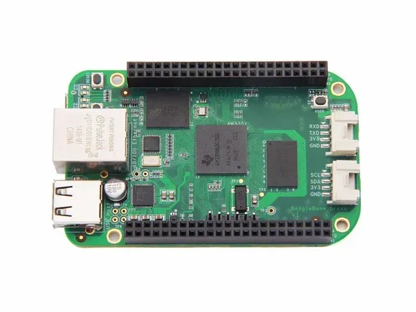
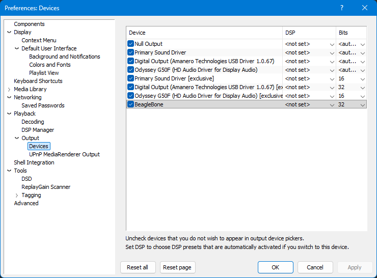
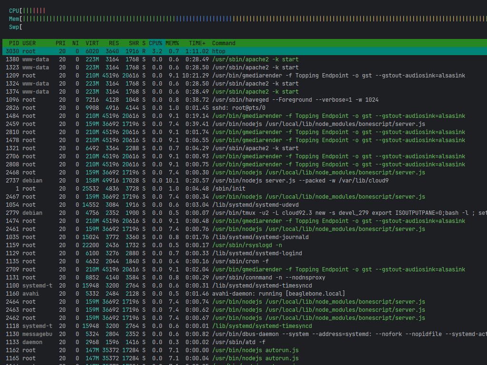
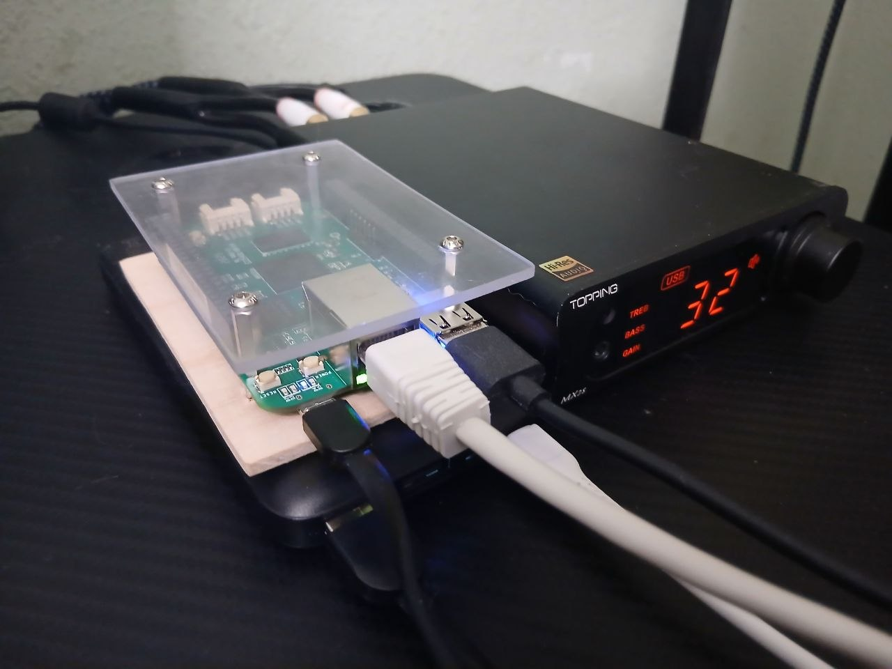
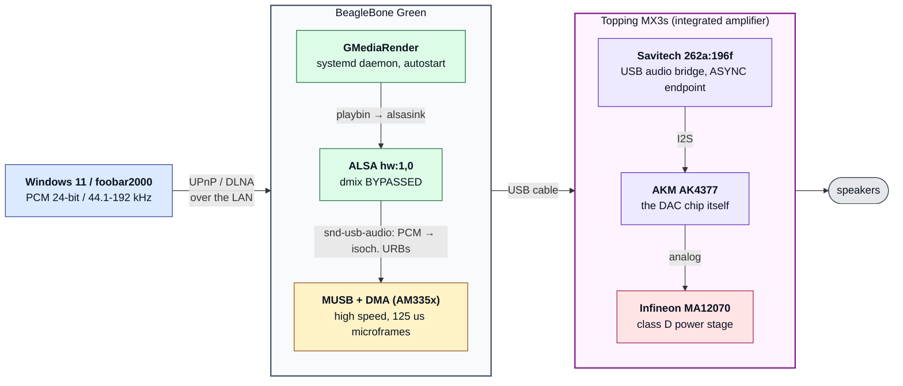

# beaglebone-gmediarender-valera

## Summary: Engineer's Log (Valera Jr. Bare-Metal Streamer)

An uncompromising audiophile streamer based on BeagleBone Green.
The architecture entirely eliminates proprietary shells, redundant software conversions, and marketing crutches (such as
esoteric cables or uncontrolled sample-rate conversions).

|                 1. Embedded Board                 |                       2. Media App                        |                          3. Endpoint                          |
|:-------------------------------------------------:|:---------------------------------------------------------:|:-------------------------------------------------------------:|
|  |  |  |

|          Valera-MIPS          |                  htop                   |          an absolute bit-perfect, bare-metal pass-through!          |
|:-----------------------------:|:---------------------------------------:|:-------------------------------------------------------------------:|
|  |  |  |

### Key Steps & Engineering Solutions:

1. **Base Image & Internal Memory Storage:** Built on a standard, field-tested **Debian** distribution deployed directly
   onto the industrial onboard eMMC flash memory, completely eliminating fragile MicroSD-card dependencies and
   contact-wear jitter.
2. **Hardware Binding (Direct to `hw:1,0`):** The UPnP/DLNA stream is delivered via GStreamer
   (`-o gst --gstout-audiosink=alsasink`) onto the raw hardware device, routed there by `/etc/asound.conf`,
   with ALSA's `dmix` software mixer out of the path entirely.
3. **Lifting Digital Constraints:** The endpoint initializes strictly at 100% volume (`--initial-volume=100`) at the
   daemon level to maintain an absolute bit-perfect stream over the network.
4. **Power Supply:** Powered from a PC USB port, I could hear the PC. Anything that gets the board off that rail
   fixes it - a powerbank, a USB socket on a mains filter, even a phone charger. A linear supply (~$50) is the
   ideal, but not a prerequisite.

## Accessing the Board

Connect power and log into the stable onboard eMMC environment via SSH:

```bash
ssh root@beaglebone.local

```

*(Direct root access is enabled; default password is `temppwd` if not changed).*

## Configure Onboard Linux

The board ships with a factory **Debian** image pre-installed on eMMC. Check the running version immediately after first
login:

```bash
cat /etc/os-release

```

    PRETTY_NAME="Debian GNU/Linux 9 (stretch)"
    NAME="Debian GNU/Linux"
    VERSION_ID="9"
    VERSION="9 (stretch)"
    ID=debian
    HOME_URL="https://www.debian.org/"
    SUPPORT_URL="https://www.debian.org/support"
    BUG_REPORT_URL="https://bugs.debian.org/"
    root@beaglebone:~# 

The factory image includes a built-in Node.js stack and a local documentation server — accessible in the LAN at
[http://beaglebone.local](http://beaglebone.local) while the board is powered. Useful for pinout references and
peripheral programming docs without going online.

### Bypassing the Mixer: The Actual Signal Path

The critical configuration step is routing the audio stream directly to the hardware device, bypassing ALSA's
software mixer (`dmix`) entirely. The `hw:1,0` designator locks the stream to the raw kernel DMA buffer - no
mixing, no volume scaling in software.

Note what `hw:1,0` is *not* here. No I2S DAC is attached to this board. The AM335x McASP peripheral - the SoC's
native I2S engine, brought out on the P9 header - is unused, and onboard audio is stripped via device tree
overlays. The endpoint is an external asynchronous USB device, so the DMA transfer feeds the FIFO of the MUSB
USB 2.0 host controller. I2S does exist in this chain, but inside the MX3s, downstream of the USB bridge.

The MX3s itself is an integrated amplifier, not a DAC box: the Savitech bridge hands I2S to an AKM AK4377,
and its analog output drives an Infineon MA12070 class D power stage. Everything past the USB cable is one
sealed unit - the diagram below shows it only to place the I2S link where it actually is.


```mermaid
flowchart LR
    SRC["<b>Windows 11 / foobar2000</b><br/>PCM 24-bit / 44.1-192 kHz"]

    subgraph BBG["BeagleBone Green"]
        direction TB
        GMR["<b>GMediaRender</b><br/>systemd daemon, autostart"]
        ALSA["<b>ALSA hw:1,0</b><br/>dmix BYPASSED"]
        MUSB["<b>MUSB + DMA (AM335x)</b><br/>high speed, 125 us microframes"]
        GMR -- "playbin &rarr; alsasink" --> ALSA
        ALSA -- "snd-usb-audio: PCM &rarr; isoch. URBs" --> MUSB
    end

    subgraph MX3S["Topping MX3s (integrated amplifier)"]
        direction TB
        SAV["<b>Savitech 262a:196f</b><br/>USB audio bridge, ASYNC endpoint"]
        AKM["<b>AKM AK4377</b><br/>the DAC chip itself"]
        MA["<b>Infineon MA12070</b><br/>class D power stage"]
        SAV -- "I2S" --> AKM
        AKM -- "analog" --> MA
    end

    SPK(["speakers"])

    SRC -- "UPnP / DLNA<br/>over the LAN" --> BBG
    BBG -- "USB cable" --> MX3S
    MX3S --> SPK

    classDef host fill:#dbeafe,stroke:#1e3a8a,stroke-width:1px,color:#0b1220
    classDef soft fill:#dcfce7,stroke:#166534,stroke-width:1px,color:#0b1220
    classDef kern fill:#fef3c7,stroke:#92400e,stroke-width:1px,color:#0b1220
    classDef digi fill:#ede9fe,stroke:#5b21b6,stroke-width:1px,color:#0b1220
    classDef anlg fill:#ffe4e6,stroke:#9f1239,stroke-width:1px,color:#0b1220
    classDef out  fill:#e5e7eb,stroke:#374151,stroke-width:1px,color:#0b1220

    class SRC host
    class GMR soft
    class ALSA soft
    class MUSB kern
    class SAV digi
    class AKM digi
    class MA anlg
    class SPK out

    style BBG fill:#f8fafc,stroke:#475569,stroke-width:2px,color:#0b1220
    style MX3S fill:#fdf4ff,stroke:#86198f,stroke-width:2px,color:#0b1220
```

**The clock lives at the endpoint.** The playback endpoint enumerates as `ASYNC`: the DAC's own oscillator is
master, and the host adapts to its feedback. This is precisely what an S/PDIF link cannot offer - there the
receiver has to recover the clock from the wire with a PLL, and the source's oscillator, however expensive, is
discarded at the far end.

This is enforced in two places working together. The GMediaRender launch flag:

```
-o gst --gstout-audiosink=alsasink
```

And the global ALSA routing in `/etc/asound.conf` which maps `pcm.!default` to `hw:1,0`. The alsasink picks
up the default device from there — no device hardcoded in the flags, no dmix in the path.

Any `plughw:` or `default:` in `/etc/asound.conf` silently re-enables dmix and destroys bit-perfect integrity.

### Low-Level Hardware & ALSA Diagnostics

Verify that the bit-perfect stream reaches the physical layer without resampling or software mixing.

* **List active audio hardware interfaces and subdevices:**

```bash
aplay -l

```

    **** List of PLAYBACK Hardware Devices ****
    card 1: MX3s [MX3s], device 0: USB Audio [USB Audio]
      Subdevices: 1/1
      Subdevice #0: subdevice #0

* **Inspect stream routing directly from the kernel ring buffer:**

```bash
dmesg | grep -i alsa

```

    [    1.967043] ALSA device list:

> **Architectural Note:** An empty initialization list at early boot (`~1.96s`) is the correct, expected state. Onboard
> audio interfaces are explicitly stripped via device tree overlays to maintain a pristine, jitter-free environment.
> High-fidelity rendering is offloaded entirely to the external asynchronous USB DAC subsystem, which maps dynamically
> post-boot. Always use `aplay -l` to verify live endpoints.

* **Identify the USB bridge inside the MX3s:**

```bash
lsusb

```

    Bus 001 Device 002: ID 262a:196f
    Bus 001 Device 001: ID 1d6b:0002 Linux Foundation 2.0 root hub

Vendor `262a` is SAVITECH - the USB-to-I2S bridge inside the MX3s. (`152a` would mean Thesycon/XMOS, `0d8c`
C-Media.) Which bridge it is matters far less than how its endpoint is clocked, which is the next check.

* **Verify the endpoint is asynchronous and list what the DAC actually accepts:**

```bash
cat /proc/asound/card1/stream0

```

    TOPPING MX3s at usb-musb-hdrc.1-1, high speed : USB Audio

    Playback:
      Status: Running
        Interface = 2
        Altset = 2
        Momentary freq = 44100 Hz (0x5.8333)
        Feedback Format = 16.16
      Interface 2
        Altset 1
        Format: S16_LE
        Channels: 2
        Endpoint: 3 OUT (ASYNC)
        Rates: 44100, 48000, 88200, 96000, 176400, 192000
        Data packet interval: 125 us
      Interface 2
        Altset 2
        Format: S24_3LE
        Channels: 2
        Endpoint: 3 OUT (ASYNC)
        Rates: 44100, 48000, 88200, 96000, 176400, 192000
        Data packet interval: 125 us

> **Hardware ceiling - read this before tuning anything upstream.** The DAC exposes exactly two formats,
> `S16_LE` and `S24_3LE`, and tops out at 192 kHz. There is no 32-bit altsetting and no DSD altsetting on this
> device. Feeding it 32-bit or DSD unlocks nothing; it only guarantees a conversion somewhere earlier in the
> chain. Note also `Feedback Format` - that is the DAC telling the host how fast to send, which is asynchronous
> mode doing its job.

* **Prove nothing is resampling - run this while a track is playing:**

```bash
cat /proc/asound/card1/pcm0p/sub0/hw_params

```

    access: RW_INTERLEAVED
    format: S24_3LE
    subformat: STD
    channels: 2
    rate: 44100 (44100/1)
    period_size: 441
    buffer_size: 8820

The `rate` must match the source file. A 96 kHz file reporting `rate: 44100` means GStreamer inserted a
resampler, and no setting in `/etc/asound.conf` can fix that - `playbin` builds its own `audioconvert` and
`audioresample` a layer above ALSA. This file is the only honest proof of a bit-perfect path; the launch flags
are not.

### Industrial Storage Health (eMMC)

Monitor the physical integrity of the boot medium acquired from local sources.

* **Check available disk space and partition table mapping:**

```bash
df -h

```

    Filesystem      Size  Used Avail Use% Mounted on
    udev            215M     0  215M   0% /dev
    tmpfs            49M  5.3M   44M  11% /run
    /dev/mmcblk1p1  3.5G  3.1G  230M  94% /
    tmpfs           242M     0  242M   0% /dev/shm
    tmpfs           5.0M  4.0K  5.0M   1% /run/lock
    tmpfs           242M     0  242M   0% /sys/fs/cgroup
    tmpfs            49M     0   49M   0% /run/user/0

* **Inspect free RAM and system load average (ensuring < 0.1 during playback):**

```bash
htop

```

*(Install via `sudo apt install htop` if missing).*

## Installation & Deployment

1. **Create the deployment script** on your BeagleBone:

```bash
nano valera_deploy.py

```

*(Paste the updated Python code into the file and save via Ctrl+O, Enter, Ctrl+X)*

2. **Grant execution permissions:**

```bash
chmod +x valera_deploy.py

```

3. **Execute the automation pipeline:**

```bash
sudo ./valera_deploy.py

```

When the log outputs the final **🎉 GOAL!!!**, the service is locked, loaded, armed in autostart (as a canonical
unit in `/lib/systemd/system`, with any legacy drop-in purged), and waiting for your media stream.

## Configure foobar2000 on Windows 11

1. Navigate to `Preferences -> Playback -> Output -> Devices` and choose **BeagleBone Topping**.
2. Set the output bit depth to **24-bit** - not 32. The MX3s offers only `S16_LE` and `S24_3LE` over USB, so a
   32-bit stream cannot reach it intact and merely forces a downconversion inside the pipeline.
3. Leave the DSP chain empty: no resampler, no volume normalisation, no ReplayGain applied at output.
4. Fire up your heavy metal stream and enjoy pure hardware rendering.

> **On DSD:** it does not work in this build, and cannot. GStreamer 1.8.3 has no DSD decoder (`dsddec` arrived
> in 1.24), and the DAC has no DSD altsetting to receive it anyway. Feed it PCM.

## Hardware Maintenance Note

* **24/7 eMMC Operation:** This is an industrial embedded setup using solid internal flash. Power consumption is < 2W in
  peak. It is designed to run continuously without reboots.
* **If Running Off a Powerbank:** Pick one with a "low-current/always-on" mode, otherwise it goes to sleep on the
  board's low draw and cuts power during track changes.
* **Graceful Power Off:** Never pull the live power cord. Press the physical **POWER** button on the BeagleBone board
  for 1-2 seconds. The system will safely unmount filesystems from eMMC and shut down.

## Terminal Support & Diagnostics

### Process & Daemon Management

To tame the systemd hound and manage the rendering endpoint directly:

* **Verify live process memory and active command-line arguments:**

```bash
ps aux | grep gmediarender

```

* **Real-time system journal tracking (stderr/stdout output):**

```bash
journalctl -u gmediarender.service -f --no-tail

```

* **Check live daemon status:**

```bash
sudo systemctl status gmediarender

```

    ● gmediarender.service - GMediaRender UPnP Renderer
       Loaded: loaded (/lib/systemd/system/gmediarender.service; enabled; vendor preset: enabled)
       Active: active (running) since Thu 2026-06-25 22:45:59 UTC; 4h 27min ago
     Main PID: 1216 (gmediarender)
       CGroup: /system.slice/gmediarender.service
               └─1216 /usr/bin/gmediarender -f BeagleBone Topping -o gst --gstout-audiosink=alsasink
    
    Jun 25 22:45:59 beaglebone systemd[1]: Started GMediaRender UPnP Renderer.
    Jun 25 22:46:00 beaglebone gmediarender[1216]: gmediarender 0.0.7-git started [ gmediarender 0.0.7-git (libupnp-1.6.19+git20160116; glib-2.49.6; gstreamer-1.8.3) ].
    Jun 25 22:46:00 beaglebone gmediarender[1216]: Logging switched off. Enable with --logfile=<filename> (e.g. --logfile=/dev/stdout for console)
    Jun 25 22:46:11 beaglebone gmediarender[1216]: Ready for rendering.

There is no `Drop-In:` line: `valera_deploy.py` deletes `/etc/systemd/system/gmediarender.service.d` and writes
the unit itself, so the override mechanism is deliberately out of the picture.

* **Force immediate restart (applying overrides):**

```bash
sudo systemctl restart gmediarender

```

* **Wipe fail-states and clear journal anomalies:**

```bash
sudo systemctl reset-failed gmediarender

```

* **Total daemon termination:**

```bash
sudo systemctl stop gmediarender

```

### Network & End-Point Visibility

Ensure the UPnP/DLNA endpoint advertises itself properly across the local network segment.

* **Check active network sockets and port binding (UPnP port 8200):**

```bash
sudo ss -tulpn | grep gmediarender

```

* **Ping the board locally to verify zero-latency connection:**

```bash
ping -c 4 beaglebone.local

```
