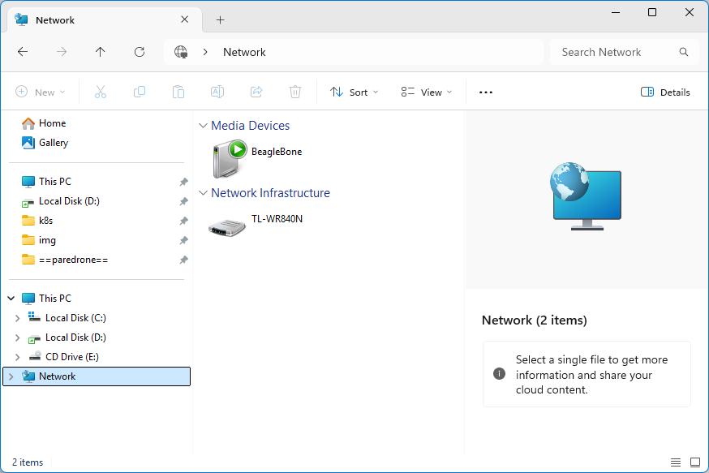

## Engineer's Log about Valera Jr. Bare-Metal Streamer

An uncompromising audiophile streamer based on BeagleBone Green.
The architecture entirely eliminates proprietary shells, redundant software conversions, and marketing crutches (such as
esoteric cables or uncontrolled sample-rate conversions).

|                  Embedded Board                   |                  UPnP Renderer                  |                         Media App                         |
|:-------------------------------------------------:|:-----------------------------------------------:|:---------------------------------------------------------:|
|  |  |  |

|          Valera Jr.           |                  htop                   |          An absolute bit-perfect, bare-metal pass-through!          |
|:-----------------------------:|:---------------------------------------:|:-------------------------------------------------------------------:|
|  |  |  |

## Bypassing the Mixer: The Actual Signal Path

The critical configuration step is routing the audio stream directly to the hardware device, bypassing ALSA's
software mixer (`dmix`) entirely. The `hw:1,0` designator locks the stream to the raw kernel DMA buffer - no
mixing, no volume scaling in software.

Note what `hw:1,0` is *not* here. No I2S DAC is attached to this board. The AM335x McASP peripheral - the SoC's
native I2S engine, brought out on the P9 header - is unused, and onboard audio is stripped via device tree
overlays. The endpoint is an external asynchronous USB device, so the DMA transfer feeds the FIFO of the MUSB
USB 2.0 host controller. I2S does exist in this chain, but inside the MX3s, downstream of the USB bridge.

The MX3s itself is an integrated amplifier, not a DAC box: the Savitech bridge hands I2S to an AKM AK4377,
and its analog output drives an Infineon MA12070 class D power stage. Everything past the USB cable is one
sealed unit - the diagram below shows it only to place the I2S link where it actually is.


```mermaid
flowchart LR
    SRC["<b>Windows 11</b><br/><b>foobar2000</b><br/>PCM 24-bit<br/>44.1-192 kHz"]

    subgraph BBG["BeagleBone Green"]
        direction TB
        GMR["<b>GMediaRender</b><br/>systemd daemon,<br/>autostart"]
        ALSA["<b>ALSA hw:1,0</b><br/>dmix BYPASSED"]
        MUSB["<b>MUSB + DMA</b><br/><b>(AM335x)</b><br/>high speed,<br/>125 us microframes"]
        GMR -- "playbin &rarr; alsasink" --> ALSA
        ALSA -- "snd-usb-audio:<br/>PCM &rarr; isoch. URBs" --> MUSB
    end

    subgraph MX3S["Topping MX3s (integrated amplifier)"]
        direction TB
        SAV["<b>Savitech</b><br/><b>262a:196f</b><br/>USB audio bridge,<br/>ASYNC endpoint"]
        AKM["<b>AKM AK4377</b><br/>the DAC<br/>chip itself"]
        MA["<b>Infineon</b><br/><b>MA12070</b><br/>class D<br/>power stage"]
        SAV -- "I2S" --> AKM
        AKM -- "analog" --> MA
    end

    SPK(["speakers"])

    SRC -- "UPnP / DLNA<br/>over the LAN" --> BBG
    BBG -- "USB cable" --> MX3S
    MX3S --> SPK

    classDef host fill:#dbeafe,stroke:#1e3a8a,stroke-width:1px,color:#0b1220
    classDef soft fill:#dcfce7,stroke:#166534,stroke-width:1px,color:#0b1220
    classDef kern fill:#fef3c7,stroke:#92400e,stroke-width:1px,color:#0b1220
    classDef digi fill:#ede9fe,stroke:#5b21b6,stroke-width:1px,color:#0b1220
    classDef anlg fill:#ffe4e6,stroke:#9f1239,stroke-width:1px,color:#0b1220
    classDef out  fill:#e5e7eb,stroke:#374151,stroke-width:1px,color:#0b1220

    class SRC host
    class GMR soft
    class ALSA soft
    class MUSB kern
    class SAV digi
    class AKM digi
    class MA anlg
    class SPK out

    style BBG fill:#f8fafc,stroke:#475569,stroke-width:2px,color:#0b1220
    style MX3S fill:#fdf4ff,stroke:#86198f,stroke-width:2px,color:#0b1220
```

**The clock lives at the endpoint.** The playback endpoint enumerates as `ASYNC`: the DAC's own oscillator is
master, and the host adapts to its feedback. This is precisely what an S/PDIF link cannot offer - there the
receiver has to recover the clock from the wire with a PLL, and the source's oscillator, however expensive, is
discarded at the far end.

This is enforced in two places working together. The GMediaRender launch flag:

```
-o gst --gstout-audiosink=alsasink
```

And the global ALSA routing in `/etc/asound.conf` which maps `pcm.!default` to `hw:1,0`. The alsasink picks
up the default device from there — no device hardcoded in the flags, no dmix in the path.

Any `plughw:` or `default:` in `/etc/asound.conf` silently re-enables dmix and destroys bit-perfect integrity.

## Accessing the Board

Connect power and log into the stable onboard eMMC environment via SSH:

```bash
ssh root@beaglebone.local

```

*(Direct root access is enabled; default password is `temppwd` if not changed).*

## Installation & Deployment

1. **Create the deployment script** on your BeagleBone:

```bash
nano valera_deploy.py

```

*(Paste the updated Python code into the file and save via Ctrl+O, Enter, Ctrl+X)*

The script detects the card index itself rather than assuming one. That matters
more than it sounds: there is no onboard codec here, so the USB DAC takes
whatever index is free - `1` on the factory eMMC image, `0` on a current one -
and a hardcoded index does not fail loudly, the renderer simply never opens the
device.

2. **Grant execution permissions:**

```bash
chmod +x valera_deploy.py

```

3. **Execute the automation pipeline:**

```bash
sudo ./valera_deploy.py

```

When the log outputs the final **🎉 GOAL!!!**, the service is locked, loaded, armed in autostart (as a canonical
unit in `/lib/systemd/system`, with any legacy drop-in purged), and waiting for your media stream.

## Network & End-Point Visibility

Ensure the UPnP/DLNA endpoint advertises itself properly across the local network segment.

* **Check active network sockets and port binding:**

```bash
sudo ss -tulpn | grep gmediarender

```

    udp UNCONN 0 0 *:1900              users:(("gmediarender",pid=1199,fd=76))
    tcp LISTEN 0 128 192.168.0.105:49494 users:(("gmediarender",pid=1199,fd=72))

No port is pinned in `ExecStart`, so libupnp picks one out of `[49152..65535]` at start and it can differ
after a restart. `1900/udp` is SSDP and is fixed. Read the TCP port out of this listing rather than
assuming a number.

* **Verify the renderer is still at volume 100 - the actual bit-perfect invariant:**

The daemon starts at 0 dB by itself, but a control point can move the slider at any time, and the moment
it does, `playbin`'s volume element leaves passthrough and starts scaling samples in software. No launch
flag can prevent that; the only honest check is to ask the running renderer. Substitute the port from the
listing above:

```bash
curl -s -X POST http://192.168.0.105:49494/upnp/control/rendercontrol1 -H 'Content-Type: text/xml; charset="utf-8"' -H 'SOAPACTION: "urn:schemas-upnp-org:service:RenderingControl:1#GetVolume"' -d '<?xml version="1.0"?><s:Envelope xmlns:s="http://schemas.xmlsoap.org/soap/envelope/" s:encodingStyle="http://schemas.xmlsoap.org/soap/encoding/"><s:Body><u:GetVolume xmlns:u="urn:schemas-upnp-org:service:RenderingControl:1"><InstanceID>0</InstanceID><Channel>Master</Channel></u:GetVolume></s:Body></s:Envelope>'

```

    <CurrentVolume>100</CurrentVolume>

Anything below 100 means the stream is being attenuated on this board. The control URL comes from
`gmediarender --dump-devicedesc`.

> **There is no `--initial-volume` flag in this build.** The volume option this version of
> gmrender-resurrect actually offers is `--gstout-initial-volume-db` (`0.0` = max, `-6` = half), listed
> under `gmediarender --help-gstout`. Since 0 dB is already the default, adding it changes nothing - and
> adding the non-existent spelling would stop the daemon from starting at all, because glib's option
> parser rejects unknown options outright. Check `--help-all` before putting any flag in the unit.

### The volume slider is the one hole in the bit-perfect claim

Worth stating plainly, because it is a mouse wheel away and nothing in the chain warns about it.
foobar2000's volume control is wired straight to this renderer: `foo_out_upnp.dll` carries
`UPnP Volume Control`, `SetVolume`, `SetMute`, `VolumeMin`/`VolumeMax` and subscribes to
`urn:schemas-upnp-org:service:RenderingControl:*`. Moving that slider sends SOAP to the board,
gmediarender puts the value on `playbin`'s `volume` property, and every sample gets multiplied in
floating point. Everything else documented here - `hw:1,0`, no dmix, WAV over FLAC, matching altset -
is undone by that one control.

**It cannot be switched off from either side.**

* On the board: `gmediarender --help-all` lists every option this build has. RenderingControl is
  compiled in and there is no flag to suppress it.
* In foobar2000: the complete set of keys `foo_out_upnp.dll` recognises is `stream-title`,
  `preferred-format`, `forced-format`, `bitdepth-max`, `supports-FLAC`, `supports-WAV`,
  `supports-LPCM`, `supports-pause`, `supports-chunked`, `supports-infinite-length`,
  `zero-length-WAV`, `send-accept-ranges`, `accept-ranges`, `reports-time`. There is no volume key
  in any spelling.

So it is a discipline, not a setting: **leave the renderer at 100 and change loudness on the MX3s
itself**, where the control is analog and downstream of the DAC. The state lives only in the running
daemon's memory, so `systemctl restart gmediarender` unconditionally returns it to 100.

The MX3s does also expose a digital volume of its own over USB Audio Class, separate from UPnP and
untouched by foobar2000:

```bash
amixer -c 1 sget PCM

```

    Simple mixer control 'PCM',0
      Capabilities: pvolume pswitch pswitch-joined
      Limits: Playback 0 - 15
      Front Left: Playback 15 [100%] [0.00dB] [on]

Confirm it reads `[0.00dB]` - that is the Savitech bridge not attenuating. It is worth checking once
and then leaving alone: sixteen steps across the whole range is a mute switch with pretensions, not a
volume control.

* **Ping the board locally to verify zero-latency connection:**

```bash
ping -c 4 beaglebone.local

```

## Low-Level Hardware & ALSA Diagnostics

Verify that the bit-perfect stream reaches the physical layer without resampling or software mixing.

* **List active audio hardware interfaces and subdevices:**

```bash
aplay -l

```

    **** List of PLAYBACK Hardware Devices ****
    card 1: MX3s [MX3s], device 0: USB Audio [USB Audio]
      Subdevices: 1/1
      Subdevice #0: subdevice #0

* **Inspect stream routing directly from the kernel ring buffer:**

```bash
dmesg | grep -i alsa

```

    [    1.967043] ALSA device list:

> **Architectural Note:** An empty initialization list at early boot (`~1.96s`) is the correct, expected state. Onboard
> audio interfaces are explicitly stripped via device tree overlays to maintain a pristine, jitter-free environment.
> High-fidelity rendering is offloaded entirely to the external asynchronous USB DAC subsystem, which maps dynamically
> post-boot. Always use `aplay -l` to verify live endpoints.

* **Identify the USB bridge inside the MX3s:**

```bash
lsusb

```

    Bus 001 Device 002: ID 262a:196f
    Bus 001 Device 001: ID 1d6b:0002 Linux Foundation 2.0 root hub

Vendor `262a` is SAVITECH - the USB-to-I2S bridge inside the MX3s. (`152a` would mean Thesycon/XMOS, `0d8c`
C-Media.) Which bridge it is matters far less than how its endpoint is clocked, which is the next check.

* **Verify the endpoint is asynchronous and list what the DAC actually accepts:**

```bash
cat /proc/asound/card1/stream0

```

    TOPPING MX3s at usb-musb-hdrc.1-1, high speed : USB Audio

    Playback:
      Status: Running
        Interface = 2
        Altset = 2
        Momentary freq = 44100 Hz (0x5.8333)
        Feedback Format = 16.16
      Interface 2
        Altset 1
        Format: S16_LE
        Channels: 2
        Endpoint: 3 OUT (ASYNC)
        Rates: 44100, 48000, 88200, 96000, 176400, 192000
        Data packet interval: 125 us
      Interface 2
        Altset 2
        Format: S24_3LE
        Channels: 2
        Endpoint: 3 OUT (ASYNC)
        Rates: 44100, 48000, 88200, 96000, 176400, 192000
        Data packet interval: 125 us

> **Hardware ceiling - read this before tuning anything upstream.** *(2026-09-05: this describes the
> Topping MX3s. A different DAC on the same board reports `S32_LE` only, with a native DSD altsetting
> and rates to 768 kHz - see *A second endpoint: SMSL RAW-HA1* below, and read your own `stream0`
> rather than assuming these numbers.)* The DAC
> exposes exactly two formats,
> `S16_LE` and `S24_3LE`, and tops out at 192 kHz. There is no 32-bit altsetting and no DSD altsetting on this
> device. Feeding it 32-bit or DSD unlocks nothing; it only guarantees a conversion somewhere earlier in the
> chain. Note also `Feedback Format` - that is the DAC telling the host how fast to send, which is asynchronous
> mode doing its job.

* **Prove nothing is resampling, and see which format the sender actually chose - run this while a
  track is playing:**

```bash
cat /proc/asound/card1/pcm0p/sub0/hw_params

```

    access: RW_INTERLEAVED
    format: S24_3LE
    subformat: STD
    channels: 2
    rate: 44100 (44100/1)
    period_size: 441
    buffer_size: 8820

The `rate` must match the source file. A 96 kHz file reporting `rate: 44100` means GStreamer inserted a
resampler, and no setting in `/etc/asound.conf` can fix that - `playbin` builds its own `audioconvert` and
`audioresample` a layer above ALSA. This file is the only honest proof of a bit-perfect path; the launch flags
are not.

It is also the fastest way to see what the sender is really doing, because `format` follows whatever
foobar2000's UPnP plugin decided to stream - a setting that lives on the PC, not here:

| `format` says | the plugin is sending                                                            | DAC altset |
|:--------------|:---------------------------------------------------------------------------------|:-----------|
| `S24_3LE`     | 24-bit, via `preferred-format=WAV` (or the FLAC default)                         | 2          |
| `S16_LE`      | 16-bit, via `preferred-format=LPCM` - that is `audio/L16`, 16 bits by definition | 1          |

Cross-check it against the wire, which settles the FLAC-versus-WAV question without guessing:

```bash
a=$(awk '/eth0:/{print $2}' /proc/net/dev); sleep 8; b=$(awk '/eth0:/{print $2}' /proc/net/dev); echo $(( (b-a)/8 )) bytes/s

```

    ~176 KB/s  ->  16-bit LPCM      (176400 B/s raw)
    ~272 KB/s  ->  24-bit FLAC      (larger than raw 24-bit - it is not compressing anything)
    ~296 KB/s  ->  24-bit WAV       (264600 B/s raw, plus HTTP/TCP overhead)

> ~~**The FLAC finding - read this if you hear a periodic click.**~~ **Withdrawn 2026-09-05:
> the click was the kernel, not the decoder.** On `5.10.240-bone80` the same 24-bit FLAC stream
> plays clean, and frame delivery measures 0.00% off nominal. The paragraph below is kept as
> written; see *The factory kernel is the reason this board burbles* for what actually caused it
> to look conclusive. The bandwidth figures in the table above are still correct.
>
> The plugin defaults to
> `preferred-format=FLAC`, and on this board that default produces an audible click roughly once a
> minute. foobar2000 streams the entire session as one FLAC of unknown length, and GStreamer 1.8.3
> here does not survive it cleanly; the plugin's own config file warns about this class of device
> outright - *"Many report that they support FLAC yet fail to play an infinite length FLAC stream"*.
> It is also pure overhead: foobar encodes at speed, so the FLAC stream measures **larger** than raw
> 24-bit PCM while still costing the board a real-time decode. Switching to `preferred-format=WAV`
> removes the decoder and keeps all 24 bits - identical `format`, identical altset, identical packet
> size, minus the clicks. See the foobar2000 section below for the full comparison, and the click
> hunt section for how everything else in the chain was eliminated first.

* **Inspect free RAM and system load average (ensuring < 0.1 during playback):**

```bash
htop

```

*(Install via `sudo apt install htop` if missing).*

## A second endpoint: SMSL RAW-HA1


Worth documenting alongside the MX3s, because the two are different classes of
device and the board treats them differently. This one carries a **Thesycon/XMOS
bridge, `152a:85dd`**, against the MX3s's Savitech `262a:196f`. On kernel 5.10
`stream0` describes it in far more detail than the factory kernel ever did:

```bash
cat /proc/asound/card1/stream0

```

    SMSL SMSL USB AUDIO at usb-musb-hdrc.1-1, high speed : USB Audio

    Playback:
      Interface 1
        Altset 1
        Format: S32_LE
        Rates: 44100, 48000, 88200, 96000, 176400, 192000, 352800, 384000, 705600, 768000
        Bits: 32
        Endpoint: 0x01 (1 OUT) (ASYNC)
        Sync Endpoint: 0x81 (1 IN)
        Implicit Feedback Mode: No
        Data packet interval: 125 us
      Interface 1
        Altset 2
        Format: S32_LE
        Bits: 24
      Interface 1
        Altset 3
        Format: SPECIAL DSD_U32_BE
        Bits: 32
        DSD raw: DOP=0, bitrev=0

Three things there are worth reading carefully. `Sync Endpoint: 0x81` is the
feedback endpoint stated explicitly - the factory kernel only ever printed
`Feedback Format = 16.16` and left the rest implicit. Altset 2 reports **24 bits
inside a 32-bit slot**, which is why ALSA offers only `S32_LE` in both. And
altset 3 is **native DSD**, which this DAC has in hardware.

Against the MX3s, from `lsusb -v`:

|                            | Topping MX3s                    | SMSL RAW-HA1                    |
|:---------------------------|:--------------------------------|:--------------------------------|
| bridge                     | Savitech `262a:196f`            | Thesycon/XMOS `152a:85dd`       |
| formats ALSA sees          | `S16_LE`, `S24_3LE`             | `S32_LE` only                   |
| `bSubslotSize`             | 2 or 3 bytes                    | **4 bytes in every altsetting** |
| bits carried               | 16 / 24                         | 24 or 32 in a 32-bit slot       |
| top rate                   | 192 kHz                         | **768 kHz**                     |
| DSD                        | none                            | **native, `DSD_U32_BE`**        |
| `wMaxPacketSize`           | 104 / 156 bytes                 | **776 bytes**                   |
| volume control on the host | `PCM Playback Volume`, 16 steps | none at all                     |

The last row matters in practice. The MX3s exposes a mixer element, and a fresh
`alsa-utils` install found it at **8 of 15, which is -21 dB** - quiet enough to
send anyone hunting through the amplifier before thinking to check `amixer`. The
RAW-HA1 exposes nothing, so there is no digital attenuation to get wrong:

```bash
amixer -c 1 sget PCM

```

The 776-byte packet is the device declaring what it needs at 768 kHz, and the
host reserves that whether or not it is used. On the factory kernel this looked
like the reason the more capable DAC behaved worse; on 5.10 both run at ratio
1.0000 and the reservation costs nothing.

### DSD without a DSD decoder

The DAC's native DSD altsetting has never been reached from any source here.
What does work is **DoP**, and DoP is not DSD as far as this board is concerned:
it is 24-bit PCM at 352.8 kHz with a marker in the top byte, which the DAC
recognises and unwraps. GStreamer carries it without knowing what it is, which
is why DSD128 plays on the factory image whose GStreamer 1.8.3 has no DSD
decoder at all.

Playing a DSF, the amplifier's display reads `DoP  5.6448 MHz` and the board
reports:

    rate        352800 Hz, S32_LE, period 3528 / buffer 70560
    Momentary freq = 352800 Hz (0x2c.1998)
    delivered   352775 frames/s   ->  -69 ppm
    USB         2 822 400 bytes/s
    network     2 986 000 bytes/s from foobar2000

That is eight times the data rate of CD and it arrives intact. Two cautions.
DoP costs exactly twice the bandwidth of native DSD, since every DSD bit rides
inside a PCM frame with the marker overhead. And DoP is fragile in a way plain
PCM is not: the marker pattern is what identifies the stream, so a single
corrupted sample makes the DAC lose sync, and a DAC that loses sync either mutes
or plays the bits as PCM - a full-scale noise burst. Any software volume applied
anywhere in the chain destroys the markers outright, so the renderer must be at
100 and nothing may resample.

Whether the player sends DoP or converts DSD to PCM itself is decided on the PC.
Both work here; `hw_params` says which is happening - `352800` for DoP, `44100`
for a conversion.

## Configure foobar2000 on Windows 11

**The renderer is not configured under `Output -> Devices`.** That page lists local sound cards, and its
bit-depth setting has no effect whatsoever on a UPnP renderer - the stream format is decided by the
plugin. Go to `Preferences -> Playback -> Output -> UPnP MediaRenderer Output`, which is a text
configuration, and set:

```
preferred-format=WAV
```

Then leave the DSP chain empty - no resampler, no volume normalisation, no ReplayGain at output - and
start playback. The renderer negotiates the format when a stream begins, so a change here needs
playback restarted, not just applied.

### Why WAV and not the other two

The plugin offers `FLAC`, `WAV` and `LPCM`, and defaults to FLAC. On this board that default is the
wrong choice, and not by a small margin. Measured on the wire and at `hw_params`:

| `preferred-format` |      wire | ALSA gets | DAC altset | decoder on the board | clicks  |
|:-------------------|----------:|:----------|:-----------|:---------------------|:--------|
| `FLAC` (default)   | ~272 KB/s | `S24_3LE` | 2          | yes, real-time FLAC  | **yes** |
| `LPCM`             | ~176 KB/s | `S16_LE`  | 1          | no                   | no      |
| `WAV`              | ~296 KB/s | `S24_3LE` | 2          | no                   | no      |

~~**FLAC produces a periodic click.**~~ **Withdrawn 2026-09-05 - it was the kernel.** Kept below
as originally written. WAV remains a perfectly reasonable choice, but it is no longer the fix for
anything, and on CD-sourced material `LPCM` costs a third less on the bus for no loss at all.

foobar2000 streams the whole session as a single FLAC of unknown
length, and GStreamer 1.8.3 on this board does not survive it cleanly. The plugin's own configuration
file warns about exactly this class of device: *"Many report that they support FLAC yet fail to play an
infinite length FLAC stream"*. It also buys nothing here - foobar encodes at speed, so the FLAC stream
measured *larger* than raw 24-bit PCM. The board spends cycles unpacking a stream that was never
compressed.

**LPCM is `audio/L16`, which is 16 bits by definition.** There is no 24-bit LPCM in this plugin, so
choosing it silently halves the format ceiling. Fine for CD-rip material, a truncation for hi-res.

**WAV keeps 24 bits and removes the decoder.** Same altset, same USB packet size, same bytes per frame
as the FLAC path - only the decode is gone. That is why it is the right answer rather than a
compromise, and why the click hunt used it as the deciding experiment: it changes one variable.

On bit depth: match the material, do not maximise it. A 16-bit source padded to 24 gains nothing and
costs half again as much bandwidth. And 32 bits cannot reach this DAC at all - `stream0` lists exactly
two formats, `S16_LE` and `S24_3LE`, so a 32-bit stream only guarantees a conversion earlier in the
chain.

> **On DSD:** *(2026-09-05: half right. Native DSD indeed cannot work here. But DoP is not DSD as
> far as this board is concerned - it is 24-bit PCM at 352.8 kHz with markers, GStreamer 1.8.3
> carries it without knowing what it is, and DSD128 plays this way on the factory system once it
> has a 5.10 kernel: 2 822 400 bytes/s on the bus, delivered at -69 ppm.)*
> It does not work in this build, and cannot. GStreamer 1.8.3 has no DSD decoder (`dsddec`
> arrived in 1.24), and the DAC has no DSD altsetting to receive it anyway. Feed it PCM.

## Hardware Maintenance Note

* **24/7 eMMC Operation:** This is an industrial embedded setup using solid internal flash. Power consumption is < 2W in
  peak. It is designed to run continuously without reboots.
* **Do Not Power It From the PC:** on a PC USB port I could hear the PC. Anything that gets the board off that
  rail fixes it - a powerbank, a USB socket on a mains filter, even a phone charger. A linear supply (~$50) is
  the ideal, but not a prerequisite.
* **If Running Off a Powerbank:** Pick one with a "low-current/always-on" mode, otherwise it goes to sleep on the
  board's low draw and cuts power during track changes.
* **Graceful Power Off:** Never pull the live power cord. Press the physical **POWER** button on the BeagleBone board
  for 1-2 seconds. The system will safely unmount filesystems from eMMC and shut down.

## Terminal Support & Diagnostics

### Process & Daemon Management

To tame the systemd hound and manage the rendering endpoint directly:

* **Verify live process memory and active command-line arguments:**

```bash
ps aux | grep gmediarender

```

* **Real-time system journal tracking (stderr/stdout output):**

```bash
journalctl -u gmediarender.service -f --no-tail

```

* **Check live daemon status:**

```bash
sudo systemctl status gmediarender

```

    ● gmediarender.service - GMediaRender UPnP Renderer
       Loaded: loaded (/lib/systemd/system/gmediarender.service; enabled; vendor preset: enabled)
       Active: active (running) since Thu 2026-06-25 22:45:59 UTC; 4h 27min ago
     Main PID: 1216 (gmediarender)
       CGroup: /system.slice/gmediarender.service
               └─1216 /usr/bin/gmediarender -f BeagleBone -o gst --gstout-audiosink=alsasink
    
    Jun 25 22:45:59 beaglebone systemd[1]: Started GMediaRender UPnP Renderer.
    Jun 25 22:46:00 beaglebone gmediarender[1216]: gmediarender 0.0.7-git started [ gmediarender 0.0.7-git (libupnp-1.6.19+git20160116; glib-2.49.6; gstreamer-1.8.3) ].
    Jun 25 22:46:00 beaglebone gmediarender[1216]: Logging switched off. Enable with --logfile=<filename> (e.g. --logfile=/dev/stdout for console)
    Jun 25 22:46:11 beaglebone gmediarender[1216]: Ready for rendering.

There is no `Drop-In:` line: `valera_deploy.py` deletes `/etc/systemd/system/gmediarender.service.d` and writes
the unit itself, so the override mechanism is deliberately out of the picture.

* **Force immediate restart (applying overrides):**

```bash
sudo systemctl restart gmediarender

```

* **Wipe fail-states and clear journal anomalies:**

```bash
sudo systemctl reset-failed gmediarender

```

* **Total daemon termination:**

```bash
sudo systemctl stop gmediarender

```

### Checking that the chain actually delivers

`valera_rate_check.py` answers the one question every other measurement in this
file turned out to depend on: **does the host send the frames the DAC is asking
for?** In asynchronous USB audio the device owns the clock and requests a rate
through its feedback endpoint. If the host does not follow, the DAC FIFO drains
at the difference and breaks up on a schedule - buffer depth divided by the
deficit is the interval between audible faults.

```bash
sudo ./valera_rate_check.py

```

    card 0 (AUDIO), format S32_LE
    device advertises: 44100, 48000, 88200, 96000, 176400, 192000, 352800, ...
    45 s per rate, silence - nothing comes out of the speakers

         rate   delivered     ratio           DAC asked verdict
        44100       44100    1.0000        44100..44101 OK

It finds the card, picks the widest format the device takes and reads the rate
list out of the descriptor, so nothing is hardcoded. `--sweep` walks every rate
the DAC advertises; `-s` sets the seconds per rate. The source is `/dev/zero`,
so it can run while the amplifier is at listening volume without a sound coming
out - which also means it can be run on a system nobody is sitting at.

Read the output like this:

| what you see                                            | what it means                                                                             |
|:--------------------------------------------------------|:------------------------------------------------------------------------------------------|
| ratio `1.0000`, device asking its nominal rate          | the chain works                                                                           |
| ratio near 1, device **`PEGGED`** at some other value   | the feedback loop is not closing - the host sends at its own rate and ignores the request |
| ratio well below 1, and the same fraction at every rate | a driver defect. Saturation produces scatter and xruns, not a clean 5/6                   |
| `XRUN` in the verdict                                   | the pipeline missed its deadline - that one is above ALSA                                 |

This is the tool that ended a two-day search in forty five seconds, after the
ear-and-stopwatch method had produced four confident and wrong answers. Prefer
it to `valera_click_hunt.py`, which is kept for the record and carries a notice
saying so.

### The factory kernel is the reason this board burbles

**What the board ships with.** A factory Debian image pre-installed on eMMC. It
is worth knowing exactly how old it is before trusting anything on it, so this is
the first command to run after logging in:

```bash
cat /etc/os-release

```

    PRETTY_NAME="Debian GNU/Linux 9 (stretch)"
    NAME="Debian GNU/Linux"
    VERSION_ID="9"
    VERSION="9 (stretch)"
    ID=debian
    HOME_URL="https://www.debian.org/"
    SUPPORT_URL="https://www.debian.org/support"
    BUG_REPORT_URL="https://bugs.debian.org/"
    root@beaglebone:~# 

Stretch, end-of-life, with `4.9.78-ti-r94` under it. The userland is genuinely
worth keeping - it carries a Node.js stack and a local documentation server on
[http://beaglebone.local](http://beaglebone.local) while the board is powered,
useful for pinout references and peripheral programming docs without going
online. The kernel is not.

The image the board ships with is unusable for USB audio, and the fault is in
`4.9.78-ti-r94` specifically - not in the hardware, the power supply, the cable,
the ALSA configuration or the DAC.

**What it does.** In asynchronous USB audio the device owns the clock and
requests a rate through its feedback endpoint; the host is supposed to follow.
This kernel does not. Measured with `valera_rate_check.py`:

    delivered   43955.93 Hz     nominal 44100, -3267 ppm
    DAC asked   44320 Hz        pegged - two distinct values in 120 samples

A device reporting one value for two minutes is not regulating, it is asking for
its maximum and not being heard. The gap is 364 frames per second, which drains
a DAC FIFO of roughly 2200 frames every six seconds - and the burbles arrived
about every 6.25 s. That also explains the 4974 ppm the DAC appeared to be off
by, which is impossible for a crystal: it was not the crystal, it was a loop
that never closed.

**The fix is `5.10.240-bone80`,** the last long-term kernel before the USB-audio
endpoint rework that landed in 5.11:

|               |      4.9.78-ti-r94 |  **5.10.240-bone80** |      6.18.39-bone44 |
|:--------------|-------------------:|---------------------:|--------------------:|
| DAC asks      |           44320 Hz |         **44100 Hz** |            44100 Hz |
| host delivers |  43956 Hz (-0.33%) | **44100 Hz (0.00%)** |   36807 Hz (-16.6%) |
| by ear        | burbles, in bursts |            **clean** | constant distortion |

> **Do not use a current kernel.** `6.18` delivers exactly five sixths of the
> stream at every rate, on two different DACs, with an idle CPU, no xruns and
> nothing in the log. An exact rate-independent fraction is a defect, not
> saturation. 5.10 is the version to be on.

With 5.10 the board carries everything it is asked to: `1.0000` at 44.1, 96 and
192 kHz, and DSD128 over DoP - `S32_LE` at 352.8 kHz, **2 822 400 bytes/s** on
the bus, delivered at -69 ppm.

### Transplanting the kernel onto the factory system

The factory image is worth keeping - the bone101 documentation site, node-red,
bonescript - and the eMMC is a better place for a box that runs for weeks than a
no-name card. Since only the kernel is wrong, replace only the kernel.

**This has to be done from the factory system,** because a current microSD image
cannot see the eMMC at all: booted from the card there is no `mmcblk1` and no MMC
node for `481d8000` in the device tree, and loading the eMMC overlay explicitly
through `uboot_overlay_addr4=` does not change that. The factory system sees
both. So: pull the card, boot from eMMC, then insert the card while it runs.

Download and unpack on the card - **not** `dpkg -i`, since a package built for
trixie will run maintainer scripts a 2017 stretch has no business executing:

```bash
apt-get download linux-image-5.10.240-bone80 && dpkg-deb -x linux-image-*.deb tree

```

It comes to 51 MB - 16 in `boot/` with the device trees, 31 in
`lib/modules/`, 4.2 in `usr/lib/` - which is why it fits. Copy those three trees
onto the eMMC, then:

```bash
depmod -a 5.10.240-bone80

```

and point the factory `/boot/uEnv.txt` at it, restoring the stock command line
in the same edit:

    uname_r=5.10.240-bone80
    cmdline=coherent_pool=1M net.ifnames=0 quiet

Debian 9 with a kernel six years newer is an odd pairing and it works - the
kernel/userspace ABI is stable and systemd 232 does not object. The old kernel
stays installed, so rolling back is one line.

